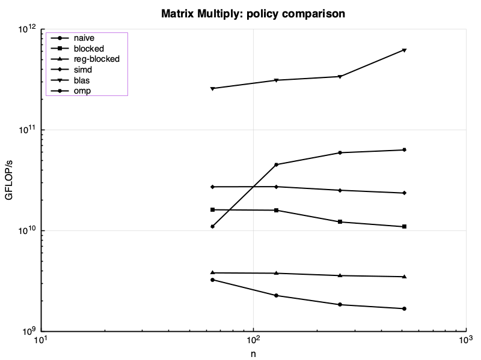
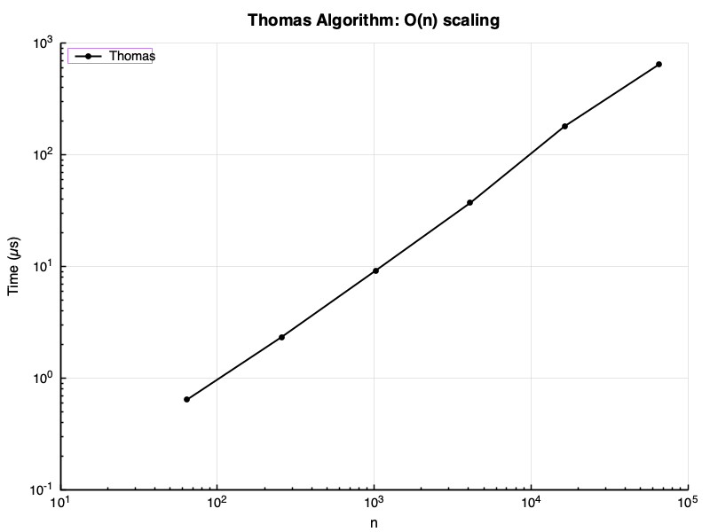
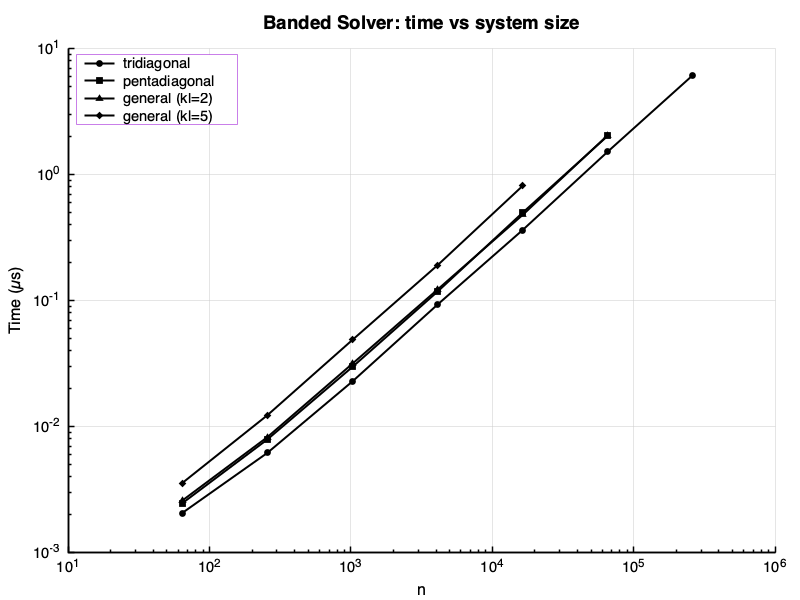
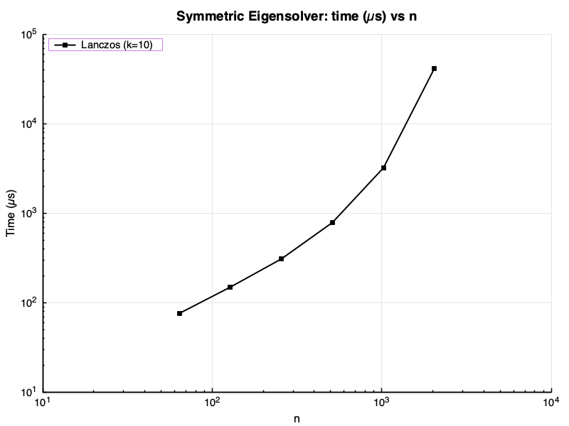
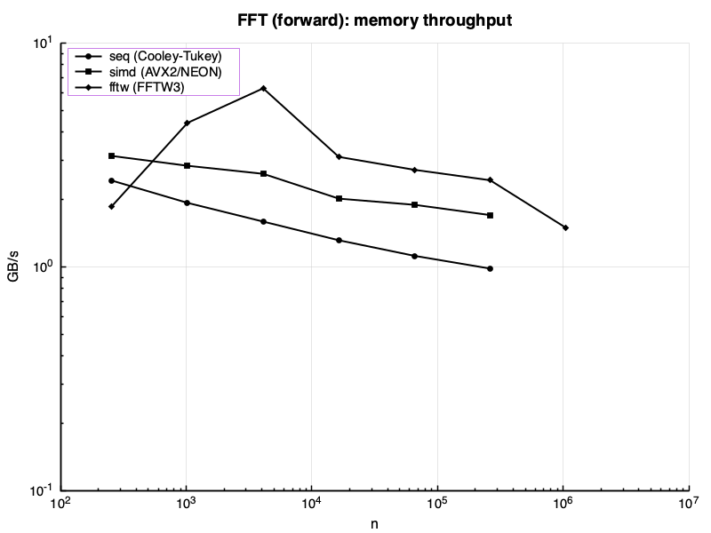
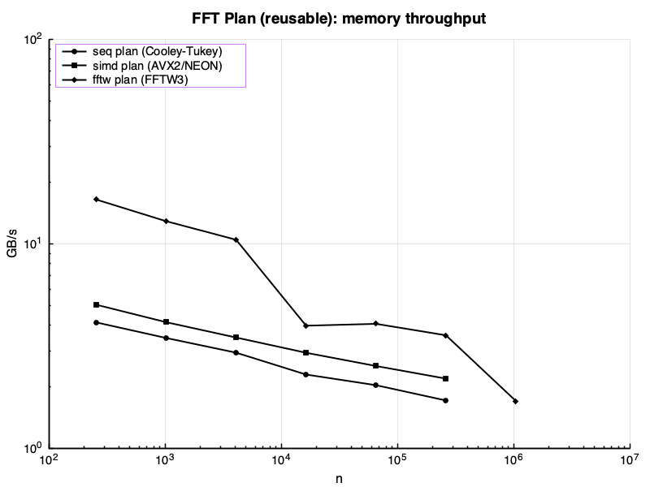
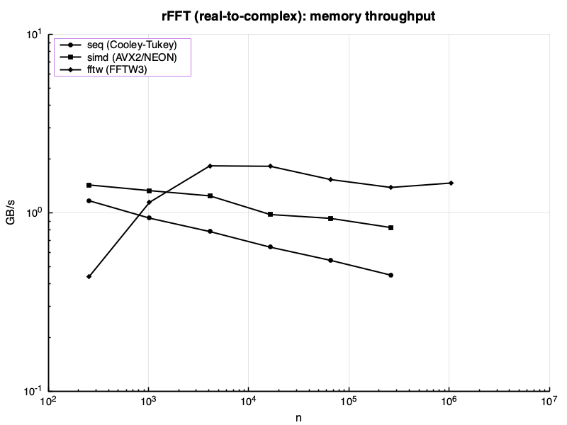

# Numerics Library — Status Report

> 2026-04-11 17:18 UTC · AppleClang 17.0.0.17000013 · Release

Auto-generated by `make report`. Each section compares our implementation against the
industry-standard LAPACK/BLAS reference. Sections without data show `[not available]`.

---

## Table of Contents

- [Build Environment](#build-environment)
- [Test Summary](#test-summary)
- [Core — Vector and Matrix](#core--vector-and-matrix)
  - [Benchmarks — Matrix Multiply](#benchmarks--matrix-multiply)
  - [Benchmarks — Matrix-Vector Multiply](#benchmarks--matrix-vector-multiply)
  - [Benchmarks — Dot Product](#benchmarks--dot-product)
  - [Benchmarks — Axpy](#benchmarks--axpy)
- [Factorizations](#factorizations)
  - [LU Factorization](#lu-factorization)
  - [QR Factorization](#qr-factorization)
  - [Thomas Tridiagonal Solver](#thomas-tridiagonal-solver)
- [Iterative Solvers](#iterative-solvers)
  - [Conjugate Gradient](#conjugate-gradient)
- [Banded Matrices](#banded-matrices)
- [Eigensolvers](#eigensolvers)
  - [Full Symmetric Eigensolver](#full-symmetric-eigensolver)
  - [Lanczos (Matrix-Free)](#lanczos-matrix-free)
- [Singular Value Decomposition](#singular-value-decomposition)
  - [Full SVD](#full-svd)
  - [Randomized Truncated SVD](#randomized-truncated-svd)
- [Analysis](#analysis)
- [Spectral — FFT](#spectral--fft)

---

## Build Environment

### System

| Property | Value |
|----------|-------|
| OS       | macOS |
| CPU      | 8 core Apple M1 Pro |
| RAM      | 16384 MB (16.0 GB) |
| GPU      | n/a |

### Backends

| Backend | Status | Notes |
|---------|--------|-------|
| BLAS / cblas | **found** | Backend::blas   -- cblas_dgemm, cblas_ddot, cblas_dgemv |
| LAPACKE | not found | Backend::lapack -- dgetrf, dgeqrf, dgesdd, dsyevd, dgtsv |
| OpenMP | **found** | Backend::omp    -- parallel blocked loops |
| FFTW3 | **found** | FFTBackend::fftw -- AVX2/NEON optimised DFT |
| CUDA | not found | Backend::gpu    -- custom kernels / cuBLAS |
| MPI | **found** | distributed ops (experimental) |

---

## Test Summary

All test suites. A failed suite must be investigated before using the library in production.

| Suite | Tests | Passed | Failed | Time |
|-------|------:|-------:|-------:|-----:|
| Vector | 7 | 7 | 0 | 0.0 ms |
| Matrix | 5 | 5 | 0 | 0.0 ms |
| MatmulPolicy | 1 | 1 | 0 | 0.0 ms |
| MatvecPolicy | 1 | 1 | 0 | 0.0 ms |
| CG | 3 | 3 | 0 | 0.0 ms |
| Thomas | 3 | 3 | 0 | 0.0 ms |
| GaussSeidel | 3 | 3 | 0 | 1.0 ms |
| Jacobi | 3 | 3 | 0 | 0.0 ms |
| GMRES | 4 | 4 | 0 | 0.0 ms |
| SparseMatrix | 3 | 3 | 0 | 0.0 ms |
| BandedMatrix | 6 | 6 | 0 | 0.0 ms |
| BandedSolver | 11 | 11 | 0 | 0.0 ms |
| BandedMatvec | 2 | 2 | 0 | 0.0 ms |
| BandedNorm | 1 | 1 | 0 | 0.0 ms |
| LU | 9 | 9 | 0 | 0.0 ms |
| QR | 7 | 7 | 0 | 0.0 ms |
| Roots | 9 | 9 | 0 | 0.0 ms |
| Quadrature | 11 | 11 | 0 | 0.0 ms |
| FFT | 13 | 13 | 0 | 2.0 ms |
| FFTPlan | 4 | 4 | 0 | 1.0 ms |
| ODE_Euler | 1 | 1 | 0 | 0.0 ms |
| ODE_RK4 | 2 | 2 | 0 | 0.0 ms |
| ODE_RK45 | 2 | 2 | 0 | 0.0 ms |
| ODE_Stepper | 2 | 2 | 0 | 0.0 ms |
| ODE_Verlet | 4 | 4 | 0 | 0.0 ms |
| ODE_Yoshida4 | 3 | 3 | 0 | 0.0 ms |
| EigSym_Jacobi | 3 | 3 | 0 | 0.0 ms |
| PowerIteration | 1 | 1 | 0 | 0.0 ms |
| Lanczos | 1 | 1 | 0 | 0.0 ms |
| SVD_Jacobi | 3 | 3 | 0 | 0.0 ms |
| SVD_Randomized | 2 | 2 | 0 | 0.0 ms |

---

## Core — Vector and Matrix

`Vector` and `Matrix` dispatch to the backend selected via the `Backend` enum
(`seq → blocked → simd → blas → omp → gpu`). With BLAS available, `default_backend`
resolves to `Backend::blas`.

### Tests

| Suite | Tests | Passed | Failed | Time |
|-------|------:|-------:|-------:|-----:|
| Vector | 7 | 7 | 0 | 0.0 ms |
| Matrix | 5 | 5 | 0 | 0.0 ms |

### Benchmarks — Matrix Multiply

Throughput: `2 n³ / time` (GFLOP/s, higher is better). Sizes n = 64…512.

| Variant | n=64 us | n=128 us | n=256 us | n=512 us |
|---------|---------|----------|----------|----------|
| naive | 160.6 | 1843.3 | 18206.4 | 159417.9 |
| blocked (auto-vec) | 32.5 | 262.8 | 2748.8 | 24516.9 |
| reg-blocked | 137.3 | 1107.8 | 9353.9 | 76734.3 |
| blocked | 32.2 | 261.4 | 2746.9 | 24546.5 |
| simd | 19.2 | 153.3 | 1331.9 | 11355.4 |
| blas | 2.0 | 13.5 | 99.2 | 445.2 |
| omp | 49.5 | 121.0 | 585.5 | 4300.9 |
| Matmul_Scalar | 141.9 | 1538.8 | 15723.6 | 145513.5 |
| Matmul_Scalar_Blocked | 116.2 | 870.0 | 6874.8 | 55773.4 |

*Time in us. Lower is better.*

### Benchmarks — Matrix-Vector Multiply

Memory-bound. GB/s = `(n² + 2n) × 8 / time`.

*Plot not available (backend absent or benchmarks not run).*

| Variant | n=64 GB/s | n=128 GB/s | n=256 GB/s | n=512 GB/s | n=1024 GB/s | n=2048 GB/s |
|---------|-----------|------------|------------|------------|-------------|-------------|
| seq | 23.38 | 16.35 | 15.39 | 11.09 | 9.69 | 9.08 |
| blocked | 23.36 | 16.35 | 15.40 | 11.12 | 9.68 | 9.06 |
| simd | 40.70 | 28.43 | 21.80 | 18.35 | 14.75 | 13.48 |
| blas | 96.60 | 139.81 | 153.75 | 163.08 | 94.72 | 33.29 |
| omp | 2.48 | 9.19 | 27.56 | 50.93 | 62.76 | 65.19 |

*Throughput in GB/s. Higher is better.*

### Benchmarks — Dot Product

*Plot not available (backend absent or benchmarks not run).*

| Variant | n=1024 GB/s | n=4096 GB/s | n=16384 GB/s | n=65536 GB/s | n=262144 GB/s | n=1048576 GB/s |
|---------|-------------|-------------|--------------|--------------|---------------|----------------|
| seq | 18.75 | 17.43 | 17.23 | 17.07 | 17.03 | 16.49 |
| blas | 116.19 | 106.10 | 82.99 | 82.89 | 81.99 | 60.46 |
| omp | 0.68 | 2.66 | 9.30 | 30.60 | 70.10 | 104.07 |

*Throughput in GB/s. Higher is better.*

### Benchmarks — Axpy (y += a·x)

*Plot not available (backend absent or benchmarks not run).*

| Variant | n=1024 GB/s | n=4096 GB/s | n=16384 GB/s | n=65536 GB/s | n=262144 GB/s | n=1048576 GB/s |
|---------|-------------|-------------|--------------|--------------|---------------|----------------|
| seq | 189.36 | 196.48 | 106.56 | 107.83 | 106.38 | 91.04 |
| blas | 194.50 | 221.28 | 227.19 | 231.24 | 232.32 | 96.77 |
| omp | 1.99 | 7.77 | 29.53 | 95.18 | 269.86 | 113.88 |

*Throughput in GB/s. Higher is better.*

---

## Factorizations

Three variants benchmarked side-by-side: **our seq**, **our omp**, **LAPACK**
(`LAPACKE_dgetrf` / `LAPACKE_dgeqrf`). With LAPACK available, `lu()` and `qr()`
default to `Backend::lapack`.

### Tests

| Suite | Tests | Passed | Failed | Time |
|-------|------:|-------:|-------:|-----:|
| Thomas | 3 | 3 | 0 | 0.0 ms |
| LU | 9 | 9 | 0 | 0.0 ms |
| QR | 7 | 7 | 0 | 0.0 ms |

### LU Factorization

LAPACK uses a blocked algorithm (BLAS-3 trailing-matrix updates via `dgemm`) that is
significantly faster than our unblocked Doolittle for large n.

*Plot not available (backend absent or benchmarks not run).*

| Variant | n=64 us | n=128 us | n=256 us | n=512 us | n=1024 us |
|---------|---------|----------|----------|----------|-----------|
| seq | 16.5 | 118.1 | 1285.1 | 10693.1 | 79879.8 |
| omp | 16.7 | 118.7 | 1290.5 | 10747.4 | 80871.9 |

*GFLOP/s: 2/3 n^3 / time. Higher is better.*

### QR Factorization

LAPACK (`dgeqrf` + `dorgqr`) uses blocked Householder with `dgemm` for panel updates.

*Plot not available (backend absent or benchmarks not run).*

| Variant | n=64 us | n=128 us | n=256 us | n=512 us |
|---------|---------|----------|----------|----------|
| seq | 241.2 | 2236.4 | 39791.0 | 506450.0 |
| omp | 240.1 | 2226.4 | 40203.8 | 508049.7 |

*GFLOP/s: 4/3 n^3 / time. Higher is better.*

### Thomas Tridiagonal Solver

O(n) direct solver. `LAPACKE_dgtsv` uses the same algorithm with additional
pivoting for stability.

| Variant | n=64 us | n=256 us | n=1024 us | n=4096 us | n=16384 us | n=65536 us |
|---------|---------|----------|-----------|-----------|------------|------------|
| Thomas | 0.6 | 2.3 | 9.2 | 37.1 | 179.9 | 643.5 |

*Time in us. Linear O(n) scaling expected.*

---

## Iterative Solvers

### Tests

| Suite | Tests | Passed | Failed | Time |
|-------|------:|-------:|-------:|-----:|
| CG | 3 | 3 | 0 | 0.0 ms |
| GaussSeidel | 3 | 3 | 0 | 1.0 ms |
| Jacobi | 3 | 3 | 0 | 0.0 ms |

### Conjugate Gradient

CG inner-product and axpy calls dispatch to `best_backend` (BLAS when available).

| Variant | n=32 us | n=64 us | n=128 us | n=256 us |
|---------|---------|---------|----------|----------|
| CG | 2.0 | 3.7 | 9.1 | 25.1 |

*Time in us. Lower is better.*

---

## Banded Matrices

### Tests

*No test data -- run `make report` to generate.*

### Benchmarks

| Variant | n=3 us | n=5 us | n=7 us | n=11 us | n=15 us | n=21 us | n=64 us | n=256 us | n=1024 us | n=4096 us | n=16384 us | n=65536 us | n=262144 us |
|---------|--------|--------|--------|---------|---------|---------|---------|----------|-----------|-----------|------------|------------|-------------|
| BandedSolve_Tridiagonal | -- | -- | -- | -- | -- | -- | 2.1 | 6.2 | 22.8 | 92.8 | 362.5 | 1518.7 | 6145.4 |
| BandedSolve_Pentadiagonal | -- | -- | -- | -- | -- | -- | 2.5 | 7.9 | 29.7 | 117.6 | 497.6 | 2027.3 | -- |
| BandedSolve_General_KL2_KU4 | -- | -- | -- | -- | -- | -- | 2.6 | 8.2 | 31.5 | 122.2 | 477.6 | 2050.6 | -- |
| BandedSolve_General_KL5_KU5 | -- | -- | -- | -- | -- | -- | 3.6 | 12.3 | 48.7 | 190.5 | 812.0 | -- | -- |
| BandedLU_Factorization | -- | -- | -- | -- | -- | -- | 1.4 | 3.8 | 13.3 | 52.7 | 207.7 | 826.5 | -- |
| BandedLU_Solve | -- | -- | -- | -- | -- | -- | 1.6 | 4.3 | 15.5 | 59.9 | 236.4 | 927.7 | -- |
| BandedSolve_MultiRHS | -- | -- | -- | -- | -- | -- | 15.3 | 59.4 | 232.3 | 929.6 | 3715.5 | -- | -- |
| BandedMatvec_Tridiagonal | -- | -- | -- | -- | -- | -- | 0.4 | 1.4 | 33.0 | 47.9 | 62.2 | 134.9 | 394.3 |
| BandedMatvec_Pentadiagonal | -- | -- | -- | -- | -- | -- | 0.6 | 2.1 | 34.2 | 45.7 | 74.7 | 177.8 | 554.2 |
| BandedSolve_Bandwidth_Scaling | 93.0 | 114.4 | 131.0 | 203.5 | 283.4 | 468.4 | -- | -- | -- | -- | -- | -- | -- |

*Time in us. Lower is better.*

---

## Eigensolvers

Three variants: **our cyclic Jacobi (seq)**, **our Jacobi (omp)**, **LAPACK `dsyevd`**
(divide-and-conquer, asymptotically fastest for dense matrices).
Lanczos is matrix-free and targets only k eigenvalues — it lives on a separate plot.

### Tests

| Suite | Tests | Passed | Failed | Time |
|-------|------:|-------:|-------:|-----:|
| PowerIteration | 1 | 1 | 0 | 0.0 ms |
| Lanczos | 1 | 1 | 0 | 0.0 ms |

### Full Symmetric Eigensolver

| Variant | n=32 us | n=64 us | n=128 us | n=256 us | n=512 us |
|---------|---------|---------|----------|----------|----------|
| seq | 165.4 | 973.2 | 15531.1 | 258993.4 | 4846223.6 |

*Time in us. Lower is better.*

### Lanczos (Matrix-Free)

k = 10 eigenvalues requested. Each step costs one matvec O(n²) plus reorthogonalisation.

| Variant | n=64 us | n=128 us | n=256 us | n=512 us | n=1024 us | n=2048 us |
|---------|---------|----------|----------|----------|-----------|-----------|
| Lanczos | 76.3 | 150.1 | 310.0 | 790.9 | 3231.1 | 41916.4 |

*Time in us (k=10 eigenvalues). Lower is better.*

---

## Singular Value Decomposition

Three variants: **our one-sided Jacobi**, **randomized truncated SVD** (top k = n/8),
**LAPACK `dgesdd`** (divide-and-conquer, fastest full SVD).

### Tests

*No test data -- run `make report` to generate.*

### Full SVD

*No benchmark data -- run `make report` to generate.*

### Randomized Truncated SVD

| Variant | n=64 us | n=128 us | n=256 us | n=512 us | n=1024 us |
|---------|---------|----------|----------|----------|-----------|
| SVD_Randomized | 269.1 | 1340.8 | 28086.0 | 263587.3 | 2310740.9 |

*Time in us (k=n/8 singular values). Lower is better.*

---

## Analysis

Root finding (bisection, Newton, secant) and numerical quadrature
(Gauss-Legendre, adaptive Simpson).

### Tests

| Suite | Tests | Passed | Failed | Time |
|-------|------:|-------:|-------:|-----:|
| Roots | 9 | 9 | 0 | 0.0 ms |
| Quadrature | 11 | 11 | 0 | 0.0 ms |

---

## Spectral — FFT

Backends: `seq` (Cooley-Tukey), `simd` (AVX2/NEON), `fftw` (FFTW3).

### Tests

| Suite | Tests | Passed | Failed | Time |
|-------|------:|-------:|-------:|-----:|
| FFT | 13 | 13 | 0 | 2.0 ms |
| FFTPlan | 4 | 4 | 0 | 1.0 ms |

### Benchmarks — Forward FFT

| Variant | n=256 GB/s | n=1024 GB/s | n=4096 GB/s | n=16384 GB/s | n=65536 GB/s | n=262144 GB/s | n=1048576 GB/s |
|---------|------------|-------------|-------------|--------------|--------------|---------------|----------------|
| seq (Cooley-Tukey) | 4.13 | 3.47 | 2.94 | 2.30 | 2.04 | 1.72 | -- |
| simd (AVX2/NEON) | 5.04 | 4.14 | 3.49 | 2.94 | 2.53 | 2.20 | -- |
| fftw (FFTW3) | 16.48 | 12.91 | 10.48 | 3.98 | 4.07 | 3.58 | 1.71 |

*Throughput in GB/s. Higher is better.*

### Benchmarks — FFT Plan (amortised)

| Variant | n=256 GB/s | n=1024 GB/s | n=4096 GB/s | n=16384 GB/s | n=65536 GB/s | n=262144 GB/s | n=1048576 GB/s |
|---------|------------|-------------|-------------|--------------|--------------|---------------|----------------|
| seq (Cooley-Tukey) | 4.13 | 3.47 | 2.94 | 2.30 | 2.04 | 1.72 | -- |
| simd (AVX2/NEON) | 5.04 | 4.14 | 3.49 | 2.94 | 2.53 | 2.20 | -- |
| fftw (FFTW3) | 16.48 | 12.91 | 10.48 | 3.98 | 4.07 | 3.58 | 1.71 |

*Throughput in GB/s. Plan creation excluded. Higher is better.*

### Benchmarks — Real-to-Complex FFT

| Variant | n=256 GB/s | n=1024 GB/s | n=4096 GB/s | n=16384 GB/s | n=65536 GB/s | n=262144 GB/s | n=1048576 GB/s |
|---------|------------|-------------|-------------|--------------|--------------|---------------|----------------|
| seq (Cooley-Tukey) | 1.17 | 0.93 | 0.79 | 0.64 | 0.54 | 0.45 | -- |
| simd (AVX2/NEON) | 1.43 | 1.33 | 1.25 | 0.98 | 0.93 | 0.83 | -- |
| fftw (FFTW3) | 0.44 | 1.15 | 1.83 | 1.82 | 1.54 | 1.39 | 1.47 |

*Throughput in GB/s. Higher is better.*

---

*Generated by `make report`.*
