# Numerics Library — Status Report

> 2026-08-22 23:44 UTC · AppleClang 17.0.0.17000013 · Release

Auto-generated by `make report`. Each section compares our implementation against the
industry-standard LAPACK/BLAS reference. Sections without data show `[not available]`.

---

## Table of Contents

- [Build Environment](#build-environment)
- [Test Summary](#test-summary)
- [Core — Vector and Matrix](#core--vector-and-matrix)
  - [Benchmarks — Matrix Multiply](#benchmarks--matrix-multiply)
  - [Benchmarks — Matrix-Vector Multiply](#benchmarks--matrix-vector-multiply)
  - [Benchmarks — Dot Product](#benchmarks--dot-product)
  - [Benchmarks — Axpy](#benchmarks--axpy)
- [Factorizations](#factorizations)
  - [LU Factorization](#lu-factorization)
  - [QR Factorization](#qr-factorization)
  - [Thomas Tridiagonal Solver](#thomas-tridiagonal-solver)
- [Iterative Solvers](#iterative-solvers)
  - [Conjugate Gradient](#conjugate-gradient)
  - [Convergence Dynamics](#convergence-dynamics)
- [Resolvent & Matrix Exponential](#resolvent--matrix-exponential)
  - [Talbot Spectral Quadrature](#talbot-spectral-quadrature)
- [Banded Matrices](#banded-matrices)
- [Eigensolvers](#eigensolvers)
  - [Full Symmetric Eigensolver](#full-symmetric-eigensolver)
  - [Lanczos (Matrix-Free)](#lanczos-matrix-free)
- [Singular Value Decomposition](#singular-value-decomposition)
  - [Full SVD](#full-svd)
  - [Randomized Truncated SVD](#randomized-truncated-svd)
- [Dynamical Systems & Symplectic ODEs](#dynamical-systems--symplectic-odes)
  - [Hamiltonian Energy Conservation](#hamiltonian-energy-conservation)
- [Analysis](#analysis)
- [Spectral — FFT](#spectral--fft)

---

## Build Environment

### System

| Property | Value |
|----------|-------|
| OS       | macOS |
| CPU      | 8 core Apple M1 Pro |
| RAM      | 16384 MB (16.0 GB) |
| GPU      | n/a |

### Backends

| Backend | Status | Notes |
|---------|--------|-------|
| BLAS / cblas | **found** | Backend::blas   -- cblas_dgemm, cblas_ddot, cblas_dgemv |
| LAPACKE | **found** | Backend::lapack -- dgetrf, dgeqrf, dgesdd, dsyevd, dgtsv |
| OpenMP | **found** | Backend::omp    -- parallel blocked loops |
| FFTW3 | **found** | FFTBackend::fftw -- AVX2/NEON optimised DFT |
| CUDA | not found | Backend::gpu    -- custom kernels / cuBLAS |
| MPI | **found** | distributed ops (experimental) |

---

## Test Summary

All test suites. A failed suite must be investigated before using the library in production.

| Suite | Tests | Passed | Failed | Time |
|-------|------:|-------:|-------:|-----:|
| Vector | 7 | 7 | 0 | 0.0 ms |
| Matrix | 7 | 7 | 0 | 0.0 ms |
| MatmulPolicy | 1 | 1 | 0 | 0.0 ms |
| MatvecPolicy | 1 | 1 | 0 | 0.0 ms |
| Resolvent | 2 | 2 | 0 | 0.0 ms |
| CG | 5 | 5 | 0 | 0.0 ms |
| MatrixProperties | 2 | 2 | 0 | 0.0 ms |
| SolveDispatch | 2 | 2 | 0 | 0.0 ms |
| Operators | 1 | 1 | 0 | 0.0 ms |
| PCG | 1 | 1 | 0 | 0.0 ms |
| MINRES | 1 | 1 | 0 | 0.0 ms |
| PDEOperators | 1 | 1 | 0 | 0.0 ms |
| Thomas | 3 | 3 | 0 | 0.0 ms |
| GaussSeidel | 3 | 3 | 0 | 2.0 ms |
| Jacobi | 3 | 3 | 0 | 0.0 ms |
| GMRES | 5 | 5 | 0 | 0.0 ms |
| SparseMatrix | 5 | 5 | 0 | 0.0 ms |
| Probability | 1 | 1 | 0 | 0.0 ms |
| Selection | 2 | 2 | 0 | 0.0 ms |
| Sequence | 1 | 1 | 0 | 0.0 ms |
| Json | 1 | 1 | 0 | 0.0 ms |
| Talbot | 2 | 2 | 0 | 0.0 ms |
| AutoResolvent | 1 | 1 | 0 | 0.0 ms |
| SparseResolvent | 1 | 1 | 0 | 1.0 ms |
| DenseResolvent | 1 | 1 | 0 | 0.0 ms |
| Hessenberg | 1 | 1 | 0 | 0.0 ms |
| HessenbergResolvent | 1 | 1 | 0 | 0.0 ms |
| BandedMatrix | 6 | 6 | 0 | 0.0 ms |
| BandedSolver | 11 | 11 | 0 | 1.0 ms |
| BandedMatvec | 2 | 2 | 0 | 0.0 ms |
| BandedNorm | 1 | 1 | 0 | 0.0 ms |
| KLU | 1 | 1 | 0 | 0.0 ms |
| Cholesky | 4 | 4 | 0 | 0.0 ms |
| AutoLinear | 1 | 1 | 0 | 0.0 ms |
| InversePrincipalBlock | 1 | 1 | 0 | 0.0 ms |
| InverseDiagonalUpdate | 2 | 2 | 0 | 0.0 ms |
| UMFPACK | 1 | 1 | 0 | 0.0 ms |
| LU | 9 | 9 | 0 | 0.0 ms |
| QR | 7 | 7 | 0 | 0.0 ms |
| Roots | 9 | 9 | 0 | 0.0 ms |
| Quadrature | 11 | 11 | 0 | 1.0 ms |
| FFT | 13 | 13 | 0 | 3.0 ms |
| FFTPlan | 4 | 4 | 0 | 1.0 ms |
| ODE_Euler | 1 | 1 | 0 | 0.0 ms |
| ODE_RK4 | 2 | 2 | 0 | 0.0 ms |
| ODE_RK45 | 2 | 2 | 0 | 0.0 ms |
| ODE_Stepper | 2 | 2 | 0 | 0.0 ms |
| ODE_Verlet | 4 | 4 | 0 | 1.0 ms |
| ODE_Yoshida4 | 3 | 3 | 0 | 0.0 ms |
| EigSym_Jacobi | 3 | 3 | 0 | 0.0 ms |
| EigSym_LAPACK | 3 | 3 | 0 | 1.0 ms |
| PowerIteration | 1 | 1 | 0 | 0.0 ms |
| Lanczos | 2 | 2 | 0 | 1.0 ms |
| SVD_Jacobi | 3 | 3 | 0 | 0.0 ms |
| SVD_LAPACK | 4 | 4 | 0 | 1.0 ms |
| SVD_Randomized | 2 | 2 | 0 | 0.0 ms |
| ScalarField3D | 1 | 1 | 0 | 0.0 ms |
| VectorField3D | 1 | 1 | 0 | 0.0 ms |
| FieldSolver | 2 | 2 | 0 | 0.0 ms |
| Solve | 2 | 2 | 0 | 0.0 ms |
| Sample | 1 | 1 | 0 | 0.0 ms |
| Umbrella | 1 | 1 | 0 | 0.0 ms |
| DebugCheck | 5 | 5 | 0 | 0.0 ms |
| DisjointSet | 4 | 4 | 0 | 1.0 ms |
| IndexedPriorityQueue | 4 | 4 | 0 | 0.0 ms |
| Graph | 7 | 7 | 0 | 0.0 ms |

---

## Core — Vector and Matrix

`Vector` and `Matrix` dispatch to the backend selected via the `Backend` enum
(`seq → blocked → simd → blas → omp → gpu`). With BLAS available, `default_backend`
resolves to `Backend::blas`.

### Tests

| Suite | Tests | Passed | Failed | Time |
|-------|------:|-------:|-------:|-----:|
| Vector | 7 | 7 | 0 | 0.0 ms |
| Matrix | 7 | 7 | 0 | 0.0 ms |

### Benchmarks — Matrix Multiply

Throughput: `2 n³ / time` (GFLOP/s, higher is better). Sizes n = 64…512.

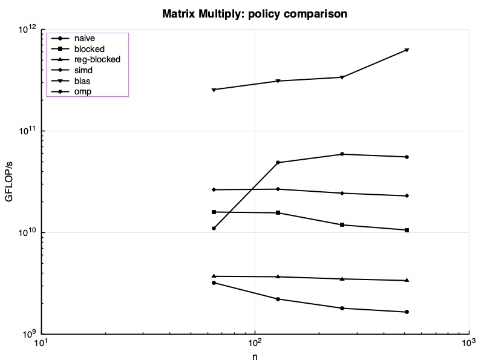

| Variant | n=64 us | n=128 us | n=256 us | n=512 us |
|---------|---------|----------|----------|----------|
| naive | 160.5 | 1835.0 | 18117.1 | 161909.2 |
| blocked (auto-vec) | 32.4 | 263.4 | 2765.0 | 24749.0 |
| reg-blocked | 138.8 | 1125.0 | 9408.5 | 77245.1 |
| blocked | 32.4 | 264.2 | 2796.1 | 24781.9 |
| simd | 19.4 | 155.2 | 1354.0 | 11633.7 |
| blas | 2.0 | 13.5 | 102.1 | 442.6 |
| omp | 50.2 | 127.7 | 584.2 | 4301.8 |
| Matmul_Scalar | 140.1 | 1586.8 | 15353.8 | 152967.9 |
| Matmul_Scalar_Blocked | 93.4 | 736.3 | 5983.4 | 47777.2 |

*Time in us. Lower is better.*

### Benchmarks — Matrix-Vector Multiply

Memory-bound. GB/s = `(n² + 2n) × 8 / time`.

*Plot not available (backend absent or benchmarks not run).*

| Variant | n=64 GB/s | n=128 GB/s | n=256 GB/s | n=512 GB/s | n=1024 GB/s | n=2048 GB/s |
|---------|-----------|------------|------------|------------|-------------|-------------|
| seq | 23.07 | 16.20 | 15.30 | 11.05 | 9.65 | 9.04 |
| blocked | 23.29 | 16.22 | 15.13 | 10.83 | 9.50 | 9.03 |
| simd | 38.91 | 28.32 | 21.66 | 18.20 | 15.02 | 13.75 |
| blas | 97.09 | 138.61 | 154.72 | 161.56 | 104.36 | 30.11 |
| omp | 2.34 | 8.66 | 26.94 | 50.97 | 63.06 | 65.87 |

*Throughput in GB/s. Higher is better.*

### Benchmarks — Dot Product

*Plot not available (backend absent or benchmarks not run).*

| Variant | n=1024 GB/s | n=4096 GB/s | n=16384 GB/s | n=65536 GB/s | n=262144 GB/s | n=1048576 GB/s |
|---------|-------------|-------------|--------------|--------------|---------------|----------------|
| seq | 18.84 | 17.41 | 17.11 | 17.04 | 16.96 | 16.86 |
| blas | 117.05 | 104.30 | 82.10 | 82.49 | 80.97 | 62.41 |
| omp | 0.63 | 2.36 | 8.69 | 27.58 | 66.93 | 102.74 |

*Throughput in GB/s. Higher is better.*

### Benchmarks — Axpy (y += a·x)

*Plot not available (backend absent or benchmarks not run).*

| Variant | n=1024 GB/s | n=4096 GB/s | n=16384 GB/s | n=65536 GB/s | n=262144 GB/s | n=1048576 GB/s |
|---------|-------------|-------------|--------------|--------------|---------------|----------------|
| seq | 190.04 | 195.65 | 104.65 | 101.91 | 103.43 | 88.96 |
| blas | 194.19 | 223.00 | 228.84 | 232.60 | 230.44 | 85.87 |
| omp | 1.88 | 7.02 | 25.09 | 67.76 | 145.66 | 184.10 |

*Throughput in GB/s. Higher is better.*

---

## Factorizations

Three variants benchmarked side-by-side: **our seq**, **our omp**, **LAPACK**
(`LAPACKE_dgetrf` / `LAPACKE_dgeqrf`). With LAPACK available, `lu()` and `qr()`
default to `Backend::lapack`.

### Tests

| Suite | Tests | Passed | Failed | Time |
|-------|------:|-------:|-------:|-----:|
| Thomas | 3 | 3 | 0 | 0.0 ms |
| LU | 9 | 9 | 0 | 0.0 ms |
| QR | 7 | 7 | 0 | 0.0 ms |

### LU Factorization

LAPACK uses a blocked algorithm (BLAS-3 trailing-matrix updates via `dgemm`) that is
significantly faster than our unblocked Doolittle for large n.

*Plot not available (backend absent or benchmarks not run).*

| Variant | n=64 us | n=128 us | n=256 us | n=512 us | n=1024 us |
|---------|---------|----------|----------|----------|-----------|
| seq | 17.5 | 123.8 | 1338.8 | 11208.6 | 83374.6 |
| omp | 17.0 | 128.7 | 1369.2 | 11124.2 | 83914.5 |
| LU<Backend::lapack> | 48.7 | 323.8 | 2360.9 | 17813.3 | 133797.7 |

*GFLOP/s: 2/3 n^3 / time. Higher is better.*

### QR Factorization

LAPACK (`dgeqrf` + `dorgqr`) uses blocked Householder with `dgemm` for panel updates.

*Plot not available (backend absent or benchmarks not run).*

| Variant | n=64 us | n=128 us | n=256 us | n=512 us |
|---------|---------|----------|----------|----------|
| seq | 241.6 | 2241.5 | 39864.9 | 509775.3 |
| omp | 242.3 | 2257.0 | 40052.0 | 511626.0 |
| QR<Backend::lapack> | 173.4 | 1683.9 | 14678.7 | 133690.1 |

*GFLOP/s: 4/3 n^3 / time. Higher is better.*

### Thomas Tridiagonal Solver

O(n) direct solver. `LAPACKE_dgtsv` uses the same algorithm with additional
pivoting for stability.

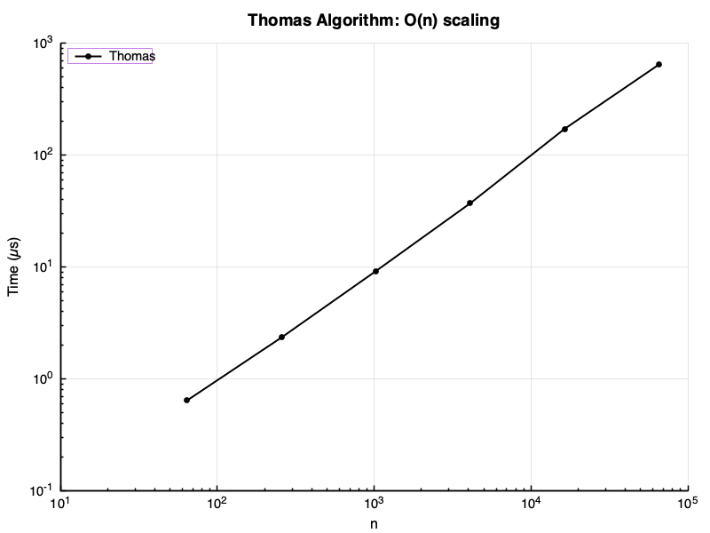

| Variant | n=64 us | n=256 us | n=1024 us | n=4096 us | n=16384 us | n=65536 us |
|---------|---------|----------|-----------|-----------|------------|------------|
| Thomas | 1.2 | 4.5 | 16.7 | 66.3 | 285.7 | 1065.6 |

*Time in us. Linear O(n) scaling expected.*

---

## Iterative Solvers

### Tests

| Suite | Tests | Passed | Failed | Time |
|-------|------:|-------:|-------:|-----:|
| CG | 5 | 5 | 0 | 0.0 ms |
| GaussSeidel | 3 | 3 | 0 | 2.0 ms |
| Jacobi | 3 | 3 | 0 | 0.0 ms |

### Conjugate Gradient

CG inner-product and axpy calls dispatch to `best_backend` (BLAS when available).

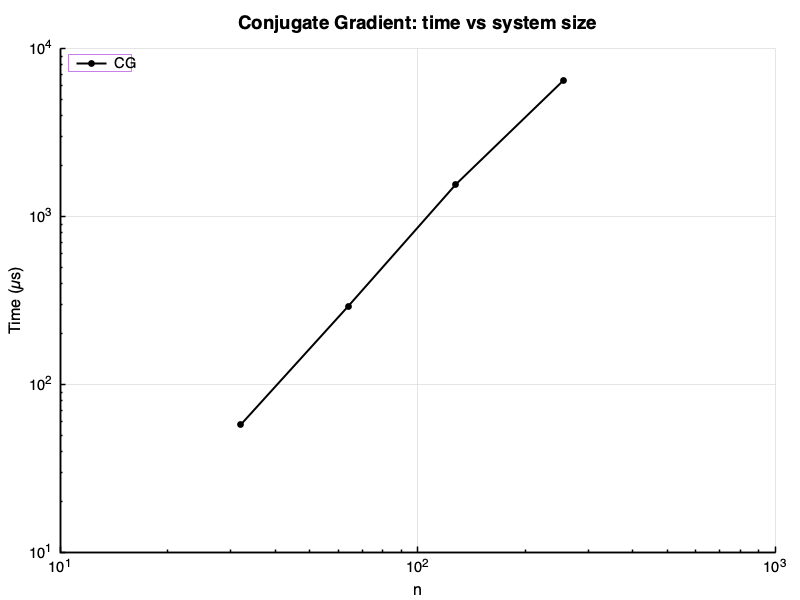

| Variant | n=32 us | n=64 us | n=128 us | n=256 us |
|---------|---------|---------|----------|----------|
| CG | 2.1 | 3.9 | 9.1 | 25.3 |

*Time in us. Lower is better.*

### Convergence Dynamics

Relative residual reduction $\frac{\|r_k\|}{\|b\|}$ across iterations on anisotropic 2D Poisson ($N = 1024$ nodes):

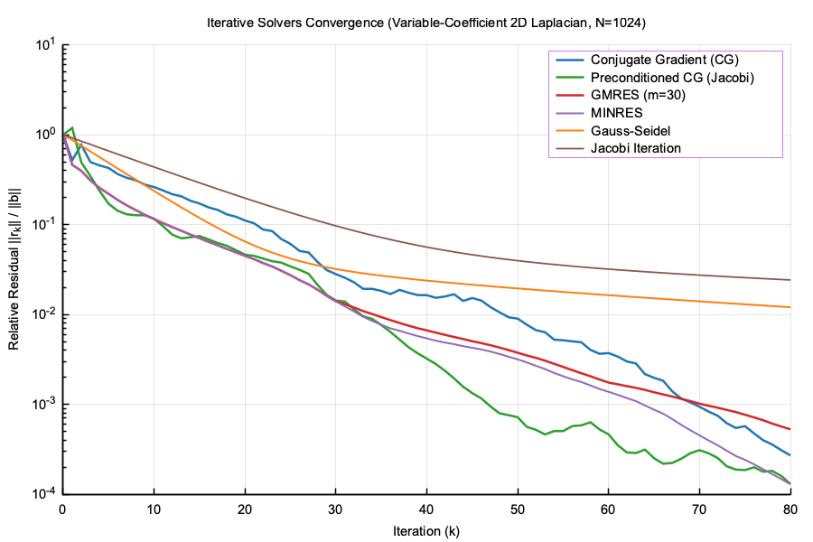

### MINRES vs Conjugate Gradient (Error & Residual Comparison)

Comparison of monotonicity in residual 2-norm versus $A$-norm energy minimization between MINRES and CG:

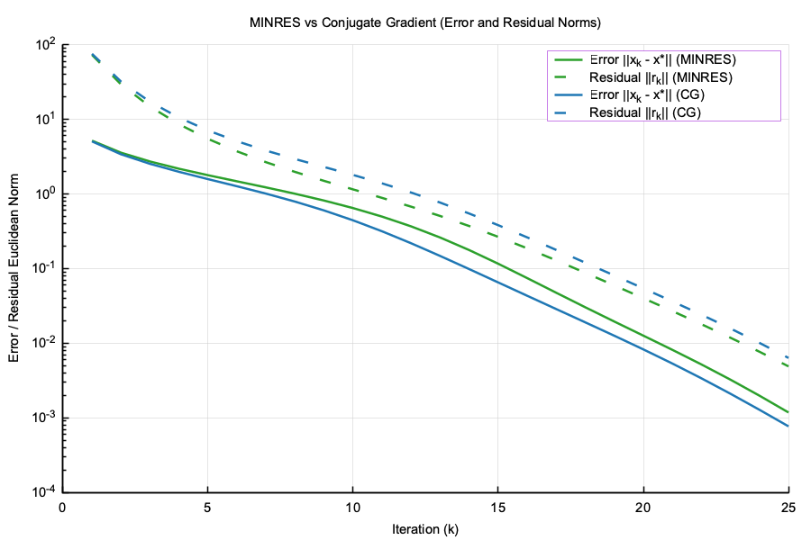

---

## Resolvent & Matrix Exponential

### Talbot Spectral Quadrature

Evaluation of matrix exponential action $e^{t Q} p_0$ via Weideman-Talbot shifted resolvent contour solves $(s_k I - Q)^{-1} p_0$ accelerated by Upper Hessenberg reduction ($O(N^3 + k N^2)$):

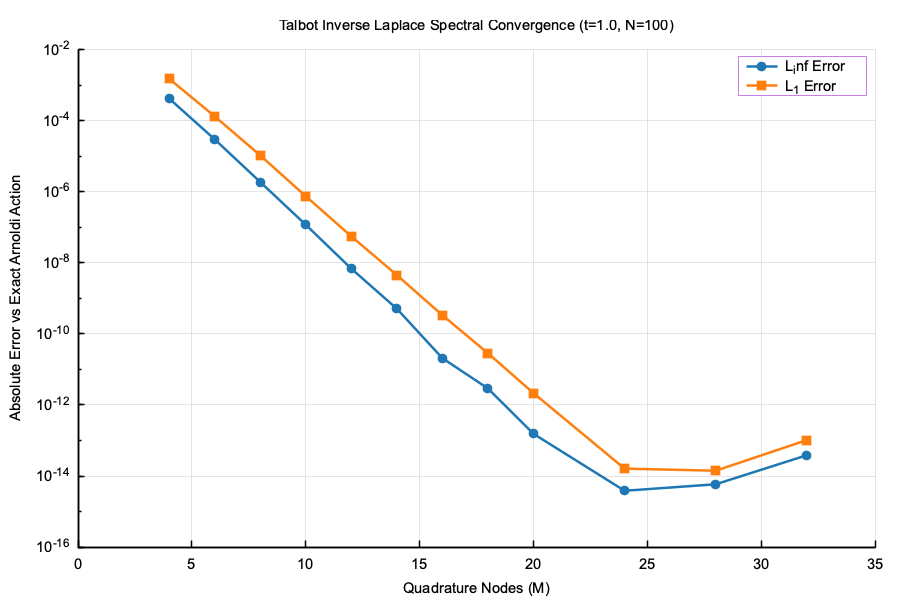

---

## Banded Matrices

### Tests

*No test data -- run `make report` to generate.*

### Benchmarks

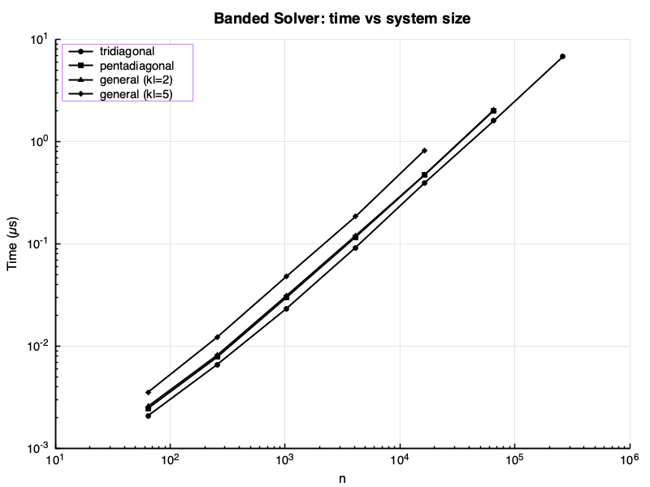

| Variant | n=3 us | n=5 us | n=7 us | n=11 us | n=15 us | n=21 us | n=64 us | n=256 us | n=1024 us | n=4096 us | n=16384 us | n=65536 us | n=262144 us |
|---------|--------|--------|--------|---------|---------|---------|---------|----------|-----------|-----------|------------|------------|-------------|
| BandedSolve_Tridiagonal | -- | -- | -- | -- | -- | -- | 2.1 | 6.6 | 23.3 | 92.1 | 395.3 | 1598.6 | 6774.2 |
| BandedSolve_Pentadiagonal | -- | -- | -- | -- | -- | -- | 2.5 | 7.8 | 29.9 | 116.5 | 473.2 | 2011.4 | -- |
| BandedSolve_General_KL2_KU4 | -- | -- | -- | -- | -- | -- | 2.6 | 8.2 | 31.1 | 120.4 | 474.3 | 2038.7 | -- |
| BandedSolve_General_KL5_KU5 | -- | -- | -- | -- | -- | -- | 3.6 | 12.3 | 48.0 | 185.1 | 824.3 | -- | -- |
| BandedLU_Factorization | -- | -- | -- | -- | -- | -- | 1.4 | 3.8 | 13.4 | 51.6 | 204.9 | 830.8 | -- |
| BandedLU_Solve | -- | -- | -- | -- | -- | -- | 1.6 | 4.3 | 15.2 | 58.9 | 233.4 | 933.5 | -- |
| BandedSolve_MultiRHS | -- | -- | -- | -- | -- | -- | 15.3 | 58.8 | 229.1 | 916.2 | 3687.8 | -- | -- |
| BandedMatvec_Tridiagonal | -- | -- | -- | -- | -- | -- | 0.4 | 1.4 | 34.0 | 41.3 | 64.6 | 139.4 | 392.2 |
| BandedMatvec_Pentadiagonal | -- | -- | -- | -- | -- | -- | 0.6 | 2.1 | 35.1 | 40.0 | 72.1 | 176.4 | 546.0 |
| BandedSolve_Bandwidth_Scaling | 95.9 | 123.6 | 145.2 | 209.1 | 298.8 | 486.8 | -- | -- | -- | -- | -- | -- | -- |

*Time in us. Lower is better.*

---

## Eigensolvers

Three variants: **our cyclic Jacobi (seq)**, **our Jacobi (omp)**, **LAPACK `dsyevd`**
(divide-and-conquer, asymptotically fastest for dense matrices).
Lanczos is matrix-free and targets only k eigenvalues — it lives on a separate plot.

### Tests

| Suite | Tests | Passed | Failed | Time |
|-------|------:|-------:|-------:|-----:|
| PowerIteration | 1 | 1 | 0 | 0.0 ms |
| Lanczos | 2 | 2 | 0 | 1.0 ms |

### Full Symmetric Eigensolver

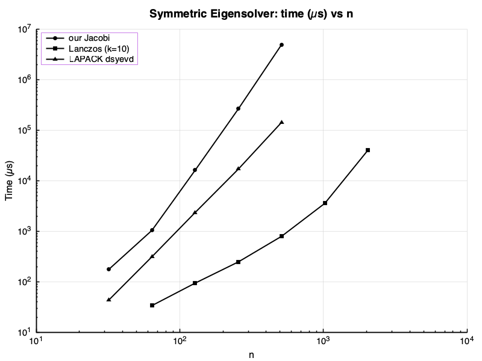

| Variant | n=32 us | n=64 us | n=128 us | n=256 us | n=512 us |
|---------|---------|---------|----------|----------|----------|
| seq | 174.4 | 1018.0 | 15585.1 | 259460.6 | 4867239.0 |
| EigSym<Backend::lapack> | 33.6 | 258.0 | 2029.9 | 16662.4 | 135271.0 |

*Time in us. Lower is better.*

### Lanczos (Matrix-Free)

k = 10 eigenvalues requested. Each step costs one matvec O(n²) plus reorthogonalisation.

| Variant | n=64 us | n=128 us | n=256 us | n=512 us | n=1024 us | n=2048 us |
|---------|---------|----------|----------|----------|-----------|-----------|
| Lanczos | 33.5 | 103.4 | 261.2 | 784.7 | 2796.2 | 40311.8 |

*Time in us (k=10 eigenvalues). Lower is better.*

---

## Singular Value Decomposition

Three variants: **our one-sided Jacobi**, **randomized truncated SVD** (top k = n/8),
**LAPACK `dgesdd`** (divide-and-conquer, fastest full SVD).

### Tests

*No test data -- run `make report` to generate.*

### Full SVD

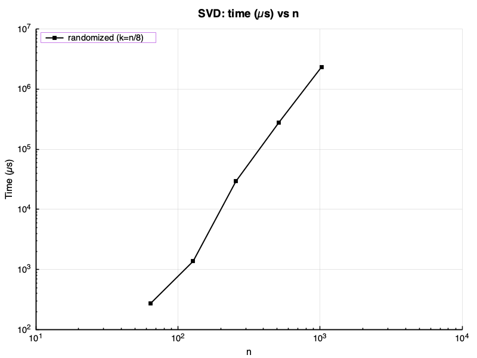

*No benchmark data -- run `make report` to generate.*

### Randomized Truncated SVD

| Variant | n=64 us | n=128 us | n=256 us | n=512 us | n=1024 us |
|---------|---------|----------|----------|----------|-----------|
| SVD_Randomized | 239.3 | 1462.1 | 22735.1 | 212677.0 | 1647578.5 |

*Time in us (k=n/8 singular values). Lower is better.*

---

## Dynamical Systems & Symplectic ODEs

### Hamiltonian Energy Conservation

Long-term energy error $|E(t) - E(0)|$ over $2 \times 10^3$ steps ($h = 0.05$):

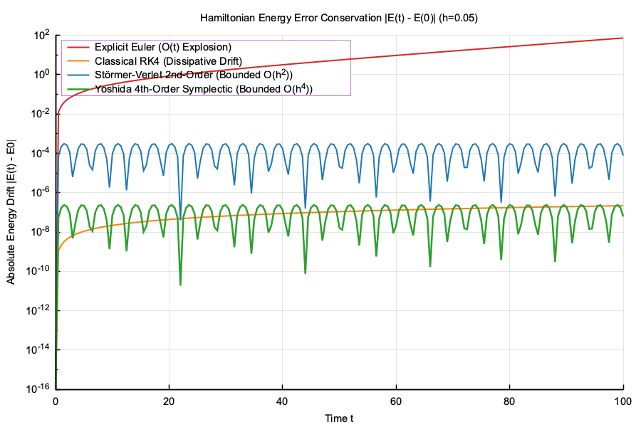

---

## Analysis

Root finding (bisection, Newton, secant) and numerical quadrature
(Gauss-Legendre, adaptive Simpson).

### Tests

| Suite | Tests | Passed | Failed | Time |
|-------|------:|-------:|-------:|-----:|
| Roots | 9 | 9 | 0 | 0.0 ms |
| Quadrature | 11 | 11 | 0 | 1.0 ms |

---

## Spectral — FFT

Backends: `seq` (Cooley-Tukey), `simd` (AVX2/NEON), `fftw` (FFTW3).

### Tests

| Suite | Tests | Passed | Failed | Time |
|-------|------:|-------:|-------:|-----:|
| FFT | 13 | 13 | 0 | 3.0 ms |
| FFTPlan | 4 | 4 | 0 | 1.0 ms |

### Benchmarks — Forward FFT

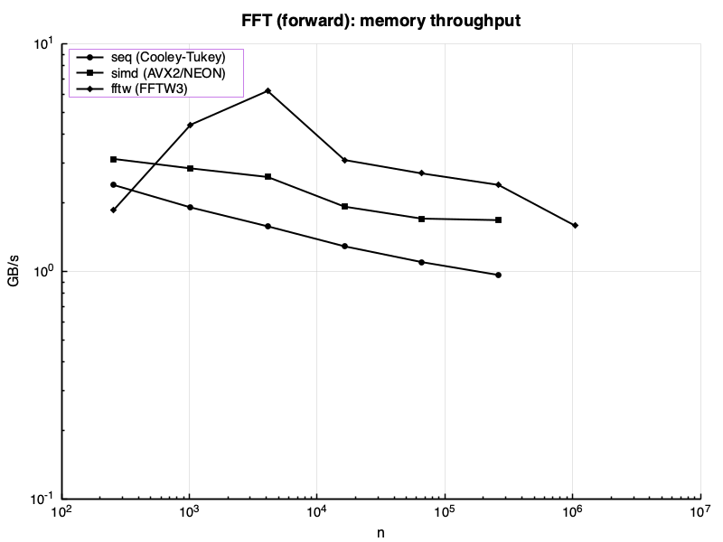

| Variant | n=256 GB/s | n=1024 GB/s | n=4096 GB/s | n=16384 GB/s | n=65536 GB/s | n=262144 GB/s | n=1048576 GB/s |
|---------|------------|-------------|-------------|--------------|--------------|---------------|----------------|
| seq (Cooley-Tukey) | 4.14 | 3.45 | 2.92 | 2.31 | 2.03 | 1.69 | -- |
| simd (AVX2/NEON) | 5.00 | 4.17 | 3.54 | 2.89 | 2.54 | 2.18 | -- |
| fftw (FFTW3) | 16.21 | 12.74 | 10.20 | 3.95 | 3.93 | 3.45 | 1.51 |

*Throughput in GB/s. Higher is better.*

### Benchmarks — FFT Plan (amortised)

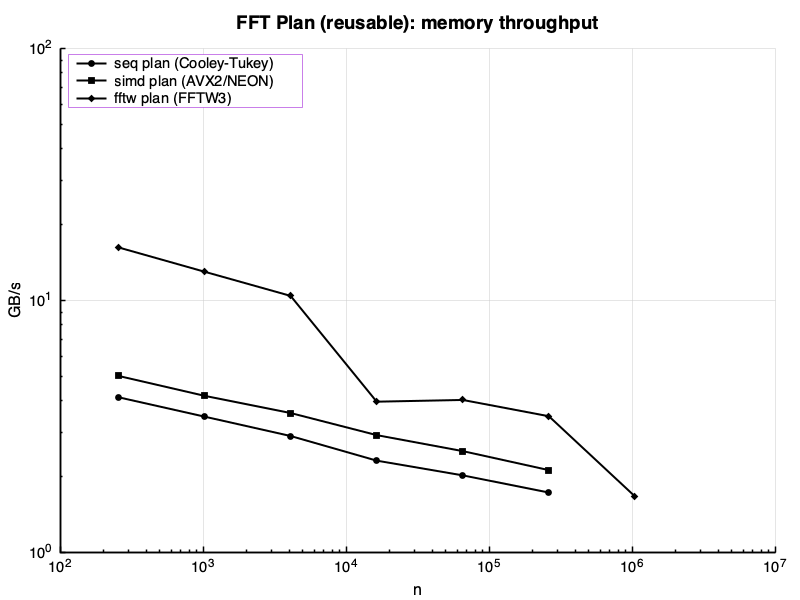

| Variant | n=256 GB/s | n=1024 GB/s | n=4096 GB/s | n=16384 GB/s | n=65536 GB/s | n=262144 GB/s | n=1048576 GB/s |
|---------|------------|-------------|-------------|--------------|--------------|---------------|----------------|
| seq (Cooley-Tukey) | 4.14 | 3.45 | 2.92 | 2.31 | 2.03 | 1.69 | -- |
| simd (AVX2/NEON) | 5.00 | 4.17 | 3.54 | 2.89 | 2.54 | 2.18 | -- |
| fftw (FFTW3) | 16.21 | 12.74 | 10.20 | 3.95 | 3.93 | 3.45 | 1.51 |

*Throughput in GB/s. Plan creation excluded. Higher is better.*

### Benchmarks — Real-to-Complex FFT

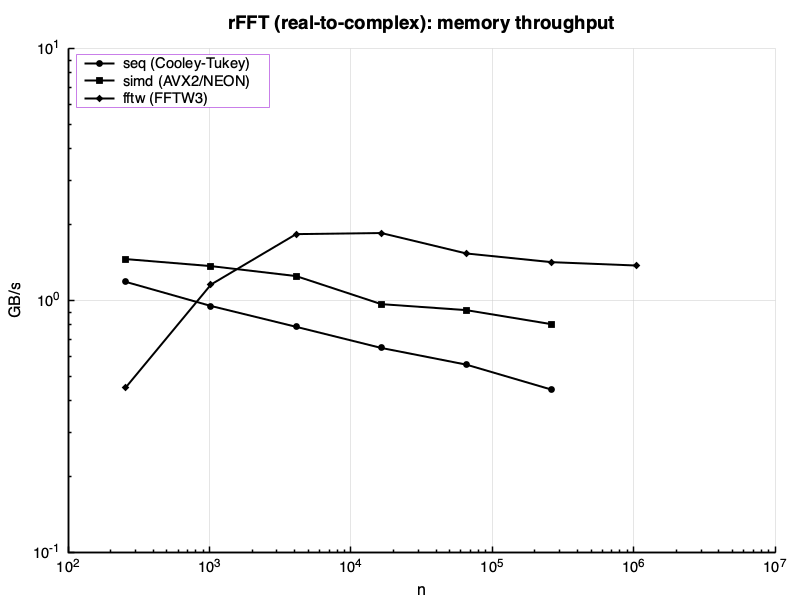

| Variant | n=256 GB/s | n=1024 GB/s | n=4096 GB/s | n=16384 GB/s | n=65536 GB/s | n=262144 GB/s | n=1048576 GB/s |
|---------|------------|-------------|-------------|--------------|--------------|---------------|----------------|
| seq (Cooley-Tukey) | 1.18 | 0.92 | 0.78 | 0.65 | 0.55 | 0.47 | -- |
| simd (AVX2/NEON) | 1.42 | 1.36 | 1.24 | 0.97 | 0.94 | 0.76 | -- |
| fftw (FFTW3) | 0.45 | 1.15 | 1.83 | 1.83 | 1.52 | 1.42 | 1.45 |

*Throughput in GB/s. Higher is better.*

---

*Generated by `make report`.*
