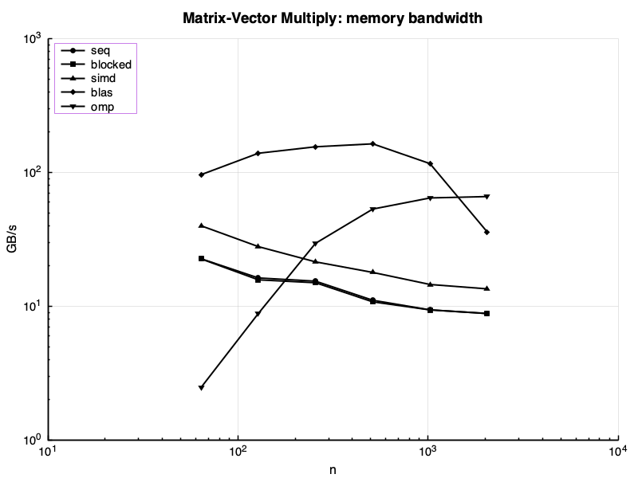
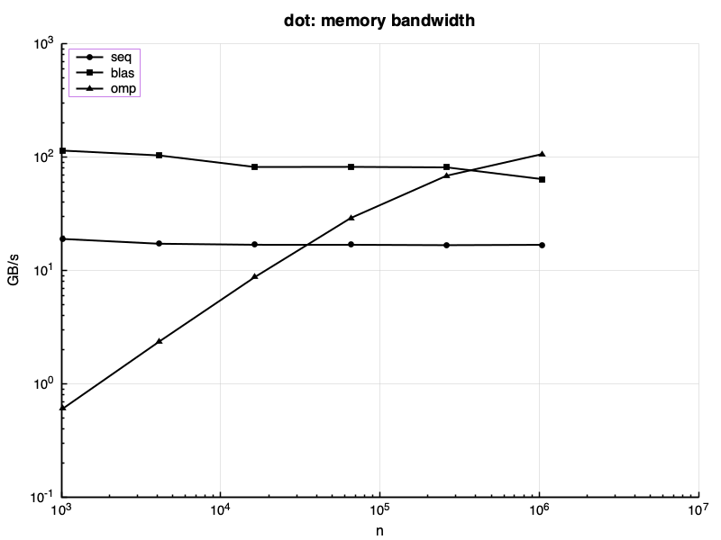
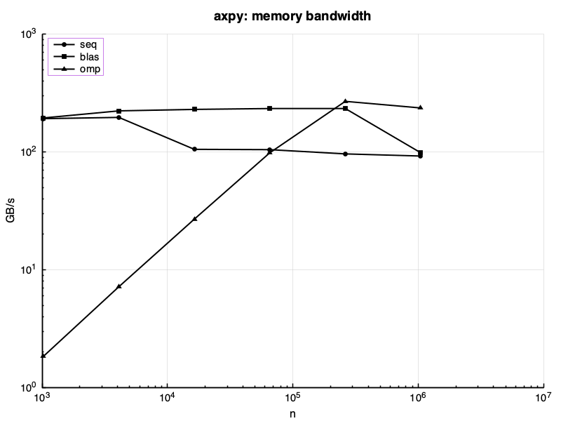
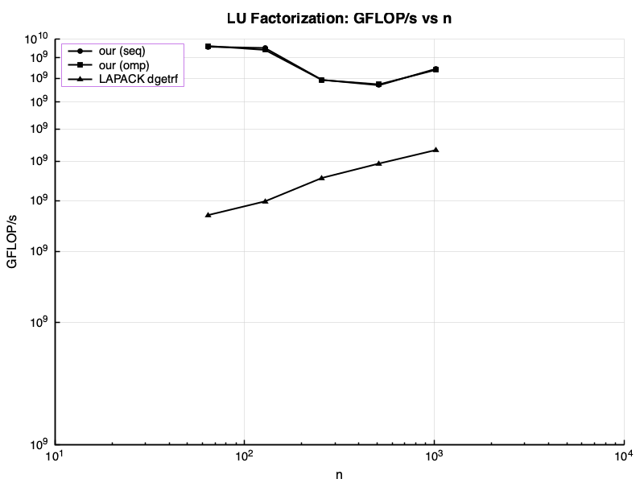
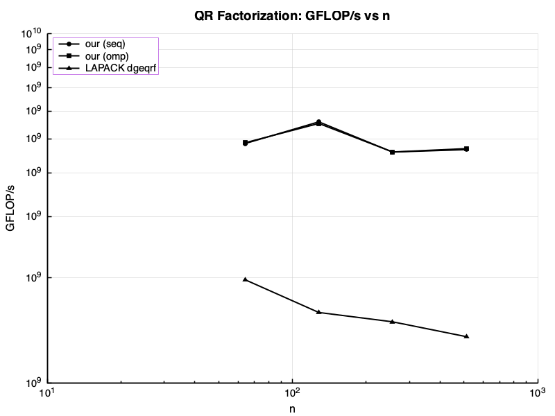

# Numerics Library — Status Report

> 2026-08-30 17:28 UTC · AppleClang 17.0.0.17000013 · Release

Auto-generated by `make report`. Each section compares our implementation against the
industry-standard LAPACK/BLAS reference. Sections without data show `[not available]`.

---

## Table of Contents

- [Build Environment](#build-environment)
- [Test Summary](#test-summary)
- [Core — Vector and Matrix](#core--vector-and-matrix)
  - [Benchmarks — Matrix Multiply](#benchmarks--matrix-multiply)
  - [Benchmarks — Matrix-Vector Multiply](#benchmarks--matrix-vector-multiply)
  - [Benchmarks — Dot Product](#benchmarks--dot-product)
  - [Benchmarks — Axpy](#benchmarks--axpy)
- [Factorizations](#factorizations)
  - [LU Factorization](#lu-factorization)
  - [QR Factorization](#qr-factorization)
  - [Thomas Tridiagonal Solver](#thomas-tridiagonal-solver)
- [Iterative Solvers](#iterative-solvers)
  - [Conjugate Gradient](#conjugate-gradient)
  - [Convergence Dynamics](#convergence-dynamics)
- [Resolvent & Matrix Exponential](#resolvent--matrix-exponential)
  - [Talbot Spectral Quadrature](#talbot-spectral-quadrature)
- [Banded Matrices](#banded-matrices)
- [Eigensolvers](#eigensolvers)
  - [Full Symmetric Eigensolver](#full-symmetric-eigensolver)
  - [Lanczos (Matrix-Free)](#lanczos-matrix-free)
- [Singular Value Decomposition](#singular-value-decomposition)
  - [Full SVD](#full-svd)
  - [Randomized Truncated SVD](#randomized-truncated-svd)
- [Dynamical Systems & Symplectic ODEs](#dynamical-systems--symplectic-odes)
  - [Hamiltonian Energy Conservation](#hamiltonian-energy-conservation)
- [Analysis](#analysis)
- [Spectral — FFT](#spectral--fft)

---

## Build Environment

### System

| Property | Value |
|----------|-------|
| OS       | macOS |
| CPU      | 8 core Apple M1 Pro |
| RAM      | 16384 MB (16.0 GB) |
| GPU      | n/a |

### Backends

| Backend | Status | Notes |
|---------|--------|-------|
| BLAS / cblas | **found** | Backend::blas   -- cblas_dgemm, cblas_ddot, cblas_dgemv |
| LAPACKE | **found** | Backend::lapack -- dgetrf, dgeqrf, dgesdd, dsyevd, dgtsv |
| OpenMP | **found** | Backend::omp    -- parallel blocked loops |
| FFTW3 | **found** | FFTBackend::fftw -- AVX2/NEON optimised DFT |
| CUDA | not found | Backend::gpu    -- custom kernels / cuBLAS |
| MPI | **found** | distributed ops (experimental) |

---

## Test Summary

All test suites. A failed suite must be investigated before using the library in production.

| Suite | Tests | Passed | Failed | Time |
|-------|------:|-------:|-------:|-----:|
| Vector | 7 | 7 | 0 | 0.0 ms |
| RawKernel | 3 | 3 | 0 | 0.0 ms |
| Matrix | 7 | 7 | 0 | 0.0 ms |
| MatmulPolicy | 1 | 1 | 0 | 0.0 ms |
| MatvecPolicy | 1 | 1 | 0 | 0.0 ms |
| MatrixExpr | 3 | 3 | 0 | 0.0 ms |
| Resolvent | 2 | 2 | 0 | 0.0 ms |
| CG | 5 | 5 | 0 | 0.0 ms |
| MatrixProperties | 2 | 2 | 0 | 0.0 ms |
| SolveDispatch | 2 | 2 | 0 | 0.0 ms |
| Operators | 1 | 1 | 0 | 0.0 ms |
| PCG | 2 | 2 | 0 | 0.0 ms |
| MINRES | 1 | 1 | 0 | 3.0 ms |
| PDEOperators | 2 | 2 | 0 | 0.0 ms |
| Thomas | 3 | 3 | 0 | 0.0 ms |
| GaussSeidel | 3 | 3 | 0 | 2.0 ms |
| Jacobi | 3 | 3 | 0 | 0.0 ms |
| GMRES | 5 | 5 | 0 | 0.0 ms |
| SparseMatrix | 5 | 5 | 0 | 0.0 ms |
| Probability | 1 | 1 | 0 | 0.0 ms |
| Selection | 2 | 2 | 0 | 0.0 ms |
| Sequence | 1 | 1 | 0 | 0.0 ms |
| Json | 1 | 1 | 0 | 0.0 ms |
| Talbot | 2 | 2 | 0 | 0.0 ms |
| AutoResolvent | 1 | 1 | 0 | 0.0 ms |
| SparseResolvent | 1 | 1 | 0 | 1.0 ms |
| DenseResolvent | 1 | 1 | 0 | 0.0 ms |
| Hessenberg | 2 | 2 | 0 | 0.0 ms |
| KernelRaw | 1 | 1 | 0 | 0.0 ms |
| HessenbergResolvent | 1 | 1 | 0 | 1.0 ms |
| BandedMatrix | 6 | 6 | 0 | 0.0 ms |
| BandedSolver | 11 | 11 | 0 | 0.0 ms |
| BandedMatvec | 2 | 2 | 0 | 0.0 ms |
| BandedNorm | 1 | 1 | 0 | 0.0 ms |
| KLU | 1 | 1 | 0 | 0.0 ms |
| Cholesky | 4 | 4 | 0 | 0.0 ms |
| AutoLinear | 2 | 2 | 0 | 0.0 ms |
| InversePrincipalBlock | 1 | 1 | 0 | 0.0 ms |
| UMFPACK | 1 | 1 | 0 | 0.0 ms |
| LU | 9 | 9 | 0 | 0.0 ms |
| QR | 7 | 7 | 0 | 0.0 ms |
| Roots | 9 | 9 | 0 | 0.0 ms |
| Quadrature | 11 | 11 | 0 | 2.0 ms |
| FFT | 13 | 13 | 0 | 2.0 ms |
| FFTPlan | 4 | 4 | 0 | 1.0 ms |
| ODE_Euler | 1 | 1 | 0 | 0.0 ms |
| ODE_RK4 | 2 | 2 | 0 | 0.0 ms |
| ODE_RK45 | 2 | 2 | 0 | 0.0 ms |
| ODE_Stepper | 2 | 2 | 0 | 0.0 ms |
| ODE_Verlet | 4 | 4 | 0 | 1.0 ms |
| ODE_Yoshida4 | 3 | 3 | 0 | 0.0 ms |
| EigSym_Jacobi | 3 | 3 | 0 | 0.0 ms |
| EigSym_LAPACK | 3 | 3 | 0 | 1.0 ms |
| PowerIteration | 1 | 1 | 0 | 0.0 ms |
| Lanczos | 2 | 2 | 0 | 1.0 ms |
| SVD_Jacobi | 3 | 3 | 0 | 0.0 ms |
| SVD_LAPACK | 4 | 4 | 0 | 1.0 ms |
| SVD_Randomized | 2 | 2 | 0 | 0.0 ms |
| ScalarField3D | 1 | 1 | 0 | 0.0 ms |
| VectorField3D | 1 | 1 | 0 | 0.0 ms |
| FieldSolver | 2 | 2 | 0 | 0.0 ms |
| Solve | 3 | 3 | 0 | 0.0 ms |
| Sample | 1 | 1 | 0 | 0.0 ms |
| Umbrella | 1 | 1 | 0 | 0.0 ms |
| DebugCheck | 6 | 6 | 0 | 0.0 ms |
| DisjointSet | 4 | 4 | 0 | 0.0 ms |
| IndexedPriorityQueue | 4 | 4 | 0 | 0.0 ms |
| Graph | 7 | 7 | 0 | 0.0 ms |
| DegreeQueue | 2 | 2 | 0 | 0.0 ms |
| Multigraph | 1 | 1 | 0 | 0.0 ms |
| MathSpine | 14 | 14 | 0 | 0.0 ms |
| RandomMat | 3 | 3 | 0 | 0.0 ms |

---

## Core — Vector and Matrix

`Vector` and `Matrix` dispatch to the backend selected via the `Backend` enum
(`seq → blocked → simd → blas → omp → gpu`). With BLAS available, `default_backend`
resolves to `Backend::blas`.

### Tests

| Suite | Tests | Passed | Failed | Time |
|-------|------:|-------:|-------:|-----:|
| Vector | 7 | 7 | 0 | 0.0 ms |
| Matrix | 7 | 7 | 0 | 0.0 ms |

### Benchmarks — Matrix Multiply

Throughput: `2 n³ / time` (GFLOP/s, higher is better). Sizes n = 64…512.

| Variant | n=64 us | n=128 us | n=256 us | n=512 us |
|---------|---------|----------|----------|----------|
| naive | 163.2 | 1889.9 | 18639.9 | 163206.8 |
| blocked (auto-vec) | 32.9 | 268.2 | 2824.0 | 25344.4 |
| reg-blocked | 141.3 | 1141.4 | 9593.2 | 79511.0 |
| Matmul<backend::blocked> | 33.0 | 268.5 | 2825.5 | 25343.6 |
| Matmul<backend::simd> | 19.8 | 156.9 | 1375.5 | 11707.8 |
| Matmul<backend::blas> | 2.1 | 13.5 | 99.4 | 443.7 |
| Matmul<backend::omp> | 54.1 | 120.3 | 607.3 | 5064.6 |
| Matmul_Scalar | 140.1 | 1582.0 | 15636.4 | 150019.2 |
| Matmul_Scalar_Blocked | 113.9 | 941.1 | 7417.0 | 59757.8 |

*Time in us. Lower is better.*

### Benchmarks — Matrix-Vector Multiply

Memory-bound. GB/s = `(n² + 2n) × 8 / time`.

| Variant | n=64 GB/s | n=128 GB/s | n=256 GB/s | n=512 GB/s | n=1024 GB/s | n=2048 GB/s |
|---------|-----------|------------|------------|------------|-------------|-------------|
| Matvec<backend::seq> | 22.68 | 16.30 | 15.42 | 11.11 | 9.41 | 8.84 |
| Matvec<backend::blocked> | 22.62 | 15.79 | 15.01 | 10.80 | 9.41 | 8.84 |
| Matvec<backend::simd> | 39.98 | 27.95 | 21.50 | 17.92 | 14.57 | 13.51 |
| Matvec<backend::blas> | 96.38 | 139.25 | 155.66 | 163.72 | 116.49 | 35.98 |
| Matvec<backend::omp> | 2.48 | 8.84 | 29.59 | 53.31 | 64.57 | 66.11 |

*Throughput in GB/s. Higher is better.*

### Benchmarks — Dot Product

| Variant | n=1024 GB/s | n=4096 GB/s | n=16384 GB/s | n=65536 GB/s | n=262144 GB/s | n=1048576 GB/s |
|---------|-------------|-------------|--------------|--------------|---------------|----------------|
| Dot<backend::seq> | 18.95 | 17.21 | 16.85 | 16.85 | 16.72 | 16.83 |
| Dot<backend::blas> | 113.99 | 103.39 | 81.71 | 81.93 | 81.13 | 63.79 |
| Dot<backend::omp> | 0.61 | 2.35 | 8.75 | 29.01 | 68.52 | 106.44 |

*Throughput in GB/s. Higher is better.*

### Benchmarks — Axpy (y += a·x)

| Variant | n=1024 GB/s | n=4096 GB/s | n=16384 GB/s | n=65536 GB/s | n=262144 GB/s | n=1048576 GB/s |
|---------|-------------|-------------|--------------|--------------|---------------|----------------|
| Axpy<backend::seq> | 191.62 | 196.28 | 105.20 | 104.55 | 96.22 | 92.30 |
| Axpy<backend::blas> | 194.28 | 223.01 | 229.48 | 233.34 | 233.51 | 98.38 |
| Axpy<backend::omp> | 1.84 | 7.19 | 26.91 | 98.32 | 268.52 | 235.98 |

*Throughput in GB/s. Higher is better.*

---

## Factorizations

Three variants benchmarked side-by-side: **our seq**, **our omp**, **LAPACK**
(`LAPACKE_dgetrf` / `LAPACKE_dgeqrf`). With LAPACK available, `lu()` and `qr()`
default to `Backend::lapack`.

### Tests

| Suite | Tests | Passed | Failed | Time |
|-------|------:|-------:|-------:|-----:|
| Thomas | 3 | 3 | 0 | 0.0 ms |
| LU | 9 | 9 | 0 | 0.0 ms |
| QR | 7 | 7 | 0 | 0.0 ms |

### LU Factorization

LAPACK uses a blocked algorithm (BLAS-3 trailing-matrix updates via `dgemm`) that is
significantly faster than our unblocked Doolittle for large n.

| Variant | n=64 us | n=128 us | n=256 us | n=512 us | n=1024 us |
|---------|---------|----------|----------|----------|-----------|
| LU<backend::seq> | 18.3 | 147.4 | 1417.1 | 11656.3 | 84814.6 |
| LU<backend::omp> | 18.2 | 149.0 | 1413.1 | 11590.8 | 85244.9 |
| LU<backend::lapack> | 47.5 | 351.7 | 2466.2 | 18172.5 | 134542.6 |

*GFLOP/s: 2/3 n^3 / time. Higher is better.*

### QR Factorization

LAPACK (`dgeqrf` + `dorgqr`) uses blocked Householder with `dgemm` for panel updates.

| Variant | n=64 us | n=128 us | n=256 us | n=512 us |
|---------|---------|----------|----------|----------|
| QR<backend::seq> | 72.5 | 500.6 | 4889.9 | 38524.3 |
| QR<backend::omp> | 71.8 | 519.6 | 4983.5 | 38218.1 |
| QR<backend::lapack> | 177.1 | 1760.0 | 14957.7 | 132007.0 |

*GFLOP/s: 4/3 n^3 / time. Higher is better.*

### Thomas Tridiagonal Solver

O(n) direct solver. `LAPACKE_dgtsv` uses the same algorithm with additional
pivoting for stability.

| Variant | n=64 us | n=256 us | n=1024 us | n=4096 us | n=16384 us | n=65536 us |
|---------|---------|----------|-----------|-----------|------------|------------|
| Thomas | 1.3 | 4.3 | 16.5 | 66.4 | 279.8 | 1119.9 |

*Time in us. Linear O(n) scaling expected.*

---

## Iterative Solvers

### Tests

| Suite | Tests | Passed | Failed | Time |
|-------|------:|-------:|-------:|-----:|
| CG | 5 | 5 | 0 | 0.0 ms |
| GaussSeidel | 3 | 3 | 0 | 2.0 ms |
| Jacobi | 3 | 3 | 0 | 0.0 ms |

### Conjugate Gradient

CG inner-product and axpy calls dispatch to `best_backend` (BLAS when available).

| Variant | n=32 us | n=64 us | n=128 us | n=256 us |
|---------|---------|---------|----------|----------|
| CG | 57.6 | 292.6 | 1554.4 | 6460.9 |

*Time in us. Lower is better.*

### Convergence Dynamics

Relative residual reduction $\frac{\|r_k\|}{\|b\|}$ across iterations on anisotropic 2D Poisson ($N = 1024$ nodes):

### MINRES vs Conjugate Gradient (Error & Residual Comparison)

Comparison of monotonicity in residual 2-norm versus $A$-norm energy minimization between MINRES and CG:

---

## Resolvent & Matrix Exponential

### Talbot Spectral Quadrature

Evaluation of matrix exponential action $e^{t Q} p_0$ via Weideman-Talbot shifted resolvent contour solves $(s_k I - Q)^{-1} p_0$ accelerated by Upper Hessenberg reduction ($O(N^3 + k N^2)$):

---

## Banded Matrices

### Tests

*No test data -- run `make report` to generate.*

### Benchmarks

| Variant | n=3 us | n=5 us | n=7 us | n=11 us | n=15 us | n=21 us | n=64 us | n=256 us | n=1024 us | n=4096 us | n=16384 us | n=65536 us | n=262144 us |
|---------|--------|--------|--------|---------|---------|---------|---------|----------|-----------|-----------|------------|------------|-------------|
| BandedSolve_Tridiagonal | -- | -- | -- | -- | -- | -- | 2.1 | 6.4 | 23.5 | 93.5 | 382.5 | 1585.7 | 6646.5 |
| BandedSolve_Pentadiagonal | -- | -- | -- | -- | -- | -- | 2.4 | 7.6 | 28.7 | 112.9 | 459.2 | 1928.8 | -- |
| BandedSolve_General_KL2_KU4 | -- | -- | -- | -- | -- | -- | 2.5 | 7.9 | 30.0 | 116.3 | 463.8 | 2074.2 | -- |
| BandedSolve_General_KL5_KU5 | -- | -- | -- | -- | -- | -- | 3.1 | 10.6 | 41.2 | 157.8 | 705.3 | -- | -- |
| BandedLU_Factorization | -- | -- | -- | -- | -- | -- | 1.4 | 3.4 | 12.2 | 46.9 | 197.4 | 814.3 | -- |
| BandedLU_Solve | -- | -- | -- | -- | -- | -- | 1.6 | 4.3 | 15.4 | 59.7 | 239.0 | 955.7 | -- |
| BandedSolve_MultiRHS | -- | -- | -- | -- | -- | -- | 15.7 | 60.8 | 239.7 | 939.8 | 3761.5 | -- | -- |
| BandedMatvec_Tridiagonal | -- | -- | -- | -- | -- | -- | 0.2 | 0.9 | 3.6 | 14.8 | 58.9 | 246.3 | 993.7 |
| BandedMatvec_Pentadiagonal | -- | -- | -- | -- | -- | -- | 0.4 | 1.4 | 5.7 | 22.8 | 90.7 | 367.5 | 1462.2 |
| BandedSolve_Bandwidth_Scaling | 95.6 | 114.6 | 124.9 | 170.8 | 232.7 | 363.9 | -- | -- | -- | -- | -- | -- | -- |

*Time in us. Lower is better.*

---

## Eigensolvers

Three variants: **our cyclic Jacobi (seq)**, **our Jacobi (omp)**, **LAPACK `dsyevd`**
(divide-and-conquer, asymptotically fastest for dense matrices).
Lanczos is matrix-free and targets only k eigenvalues — it lives on a separate plot.

### Tests

| Suite | Tests | Passed | Failed | Time |
|-------|------:|-------:|-------:|-----:|
| PowerIteration | 1 | 1 | 0 | 0.0 ms |
| Lanczos | 2 | 2 | 0 | 1.0 ms |

### Full Symmetric Eigensolver

| Variant | n=32 us | n=64 us | n=128 us | n=256 us | n=512 us |
|---------|---------|---------|----------|----------|----------|
| EigSym<backend::seq> | 176.3 | 1046.5 | 16204.0 | 265312.2 | 4955629.6 |
| EigSym<backend::lapack> | 43.6 | 314.8 | 2362.2 | 17092.3 | 143584.0 |

*Time in us. Lower is better.*

### Lanczos (Matrix-Free)

k = 10 eigenvalues requested. Each step costs one matvec O(n²) plus reorthogonalisation.

| Variant | n=64 us | n=128 us | n=256 us | n=512 us | n=1024 us | n=2048 us |
|---------|---------|----------|----------|----------|-----------|-----------|
| Lanczos | 34.0 | 94.7 | 249.2 | 799.7 | 3588.6 | 40677.0 |

*Time in us (k=10 eigenvalues). Lower is better.*

---

## Singular Value Decomposition

Three variants: **our one-sided Jacobi**, **randomized truncated SVD** (top k = n/8),
**LAPACK `dgesdd`** (divide-and-conquer, fastest full SVD).

### Tests

*No test data -- run `make report` to generate.*

### Full SVD

*No benchmark data -- run `make report` to generate.*

### Randomized Truncated SVD

| Variant | n=64 us | n=128 us | n=256 us | n=512 us | n=1024 us |
|---------|---------|----------|----------|----------|-----------|
| SVD_Randomized | 257.0 | 1522.4 | 23289.4 | 207871.4 | 1652464.9 |

*Time in us (k=n/8 singular values). Lower is better.*

---

## Dynamical Systems & Symplectic ODEs

### Hamiltonian Energy Conservation

Long-term energy error $|E(t) - E(0)|$ over $2 \times 10^3$ steps ($h = 0.05$):

---

## Analysis

Root finding (bisection, Newton, secant) and numerical quadrature
(Gauss-Legendre, adaptive Simpson).

### Tests

| Suite | Tests | Passed | Failed | Time |
|-------|------:|-------:|-------:|-----:|
| Roots | 9 | 9 | 0 | 0.0 ms |
| Quadrature | 11 | 11 | 0 | 2.0 ms |

---

## Spectral — FFT

Backends: `seq` (Cooley-Tukey), `simd` (AVX2/NEON), `fftw` (FFTW3).

### Tests

| Suite | Tests | Passed | Failed | Time |
|-------|------:|-------:|-------:|-----:|
| FFT | 13 | 13 | 0 | 2.0 ms |
| FFTPlan | 4 | 4 | 0 | 1.0 ms |

### Benchmarks — Forward FFT

| Variant | n=256 GB/s | n=1024 GB/s | n=4096 GB/s | n=16384 GB/s | n=65536 GB/s | n=262144 GB/s | n=1048576 GB/s |
|---------|------------|-------------|-------------|--------------|--------------|---------------|----------------|
| seq (Cooley-Tukey) | 3.99 | 3.39 | 2.86 | 2.26 | 1.98 | 1.61 | -- |
| simd (AVX2/NEON) | 4.90 | 4.08 | 3.49 | 2.87 | 2.46 | 2.10 | -- |
| fftw (FFTW3) | 15.98 | 12.66 | 10.16 | 3.86 | 3.89 | 3.35 | 1.67 |

*Throughput in GB/s. Higher is better.*

### Benchmarks — FFT Plan (amortised)

| Variant | n=256 GB/s | n=1024 GB/s | n=4096 GB/s | n=16384 GB/s | n=65536 GB/s | n=262144 GB/s | n=1048576 GB/s |
|---------|------------|-------------|-------------|--------------|--------------|---------------|----------------|
| seq (Cooley-Tukey) | 3.99 | 3.39 | 2.86 | 2.26 | 1.98 | 1.61 | -- |
| simd (AVX2/NEON) | 4.90 | 4.08 | 3.49 | 2.87 | 2.46 | 2.10 | -- |
| fftw (FFTW3) | 15.98 | 12.66 | 10.16 | 3.86 | 3.89 | 3.35 | 1.67 |

*Throughput in GB/s. Plan creation excluded. Higher is better.*

### Benchmarks — Real-to-Complex FFT

| Variant | n=256 GB/s | n=1024 GB/s | n=4096 GB/s | n=16384 GB/s | n=65536 GB/s | n=262144 GB/s | n=1048576 GB/s |
|---------|------------|-------------|-------------|--------------|--------------|---------------|----------------|
| seq (Cooley-Tukey) | 1.15 | 0.93 | 0.77 | 0.63 | 0.54 | 0.45 | -- |
| simd (AVX2/NEON) | 1.43 | 1.33 | 1.22 | 0.92 | 0.87 | 0.75 | -- |
| fftw (FFTW3) | 0.44 | 1.13 | 1.79 | 1.80 | 1.49 | 1.38 | 1.41 |

*Throughput in GB/s. Higher is better.*

---

*Generated by `make report`.*
