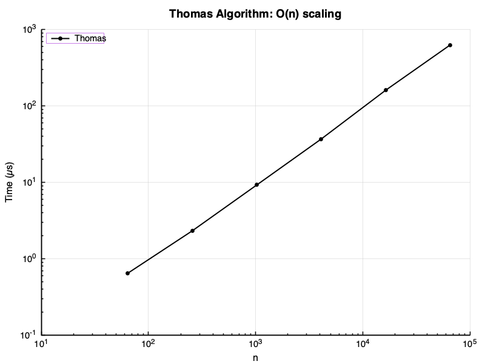
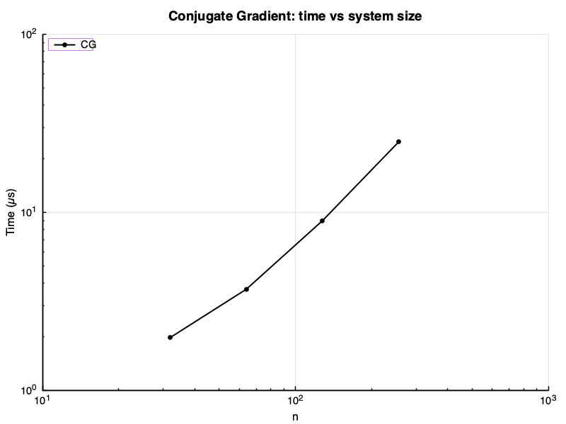
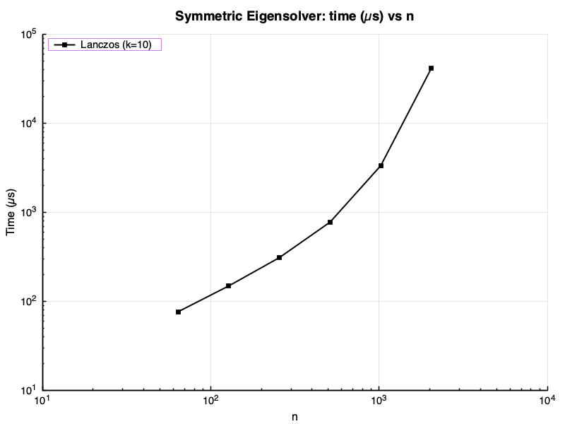
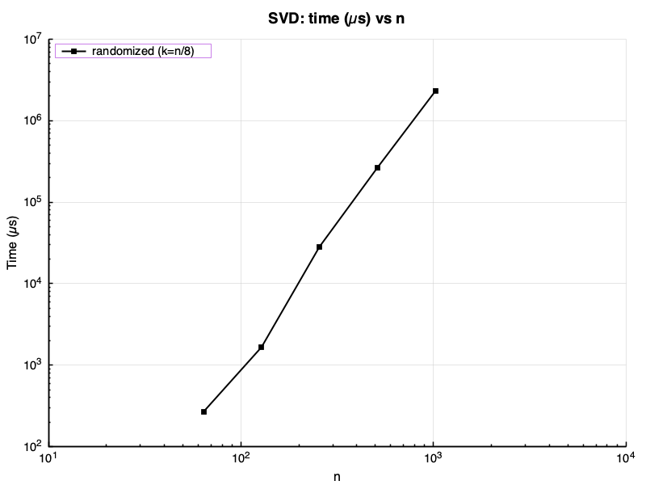
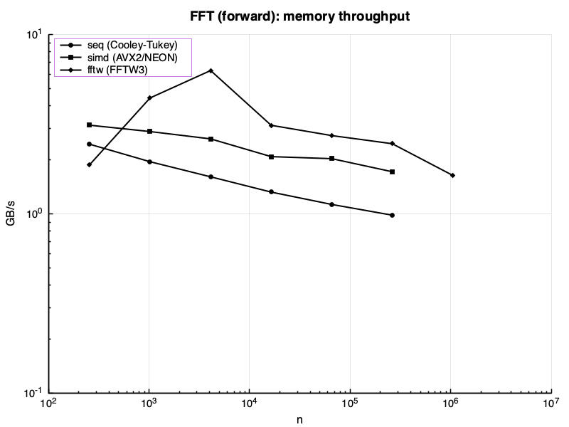
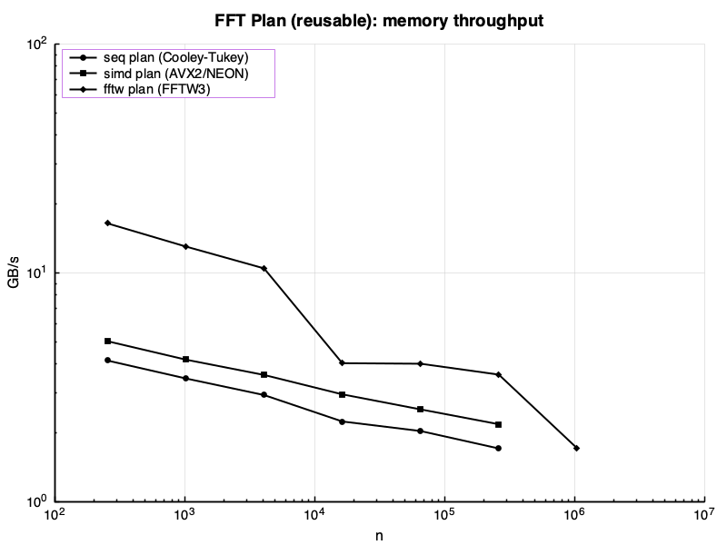
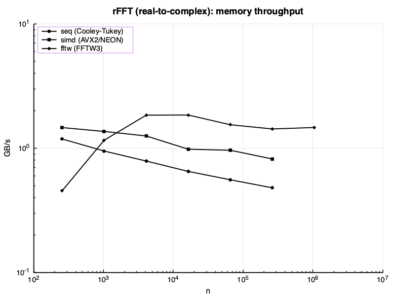

# Numerics Library — Status Report

> 2026-04-11 17:18 UTC · AppleClang 17.0.0.17000013 · Release

Auto-generated by `make report`. Each section compares our implementation against the
industry-standard LAPACK/BLAS reference. Sections without data show `[not available]`.

---

## Table of Contents

- [Build Environment](#build-environment)
- [Test Summary](#test-summary)
- [Core — Vector and Matrix](#core--vector-and-matrix)
  - [Benchmarks — Matrix Multiply](#benchmarks--matrix-multiply)
  - [Benchmarks — Matrix-Vector Multiply](#benchmarks--matrix-vector-multiply)
  - [Benchmarks — Dot Product](#benchmarks--dot-product)
  - [Benchmarks — Axpy](#benchmarks--axpy)
- [Factorizations](#factorizations)
  - [LU Factorization](#lu-factorization)
  - [QR Factorization](#qr-factorization)
  - [Thomas Tridiagonal Solver](#thomas-tridiagonal-solver)
- [Iterative Solvers](#iterative-solvers)
  - [Conjugate Gradient](#conjugate-gradient)
- [Banded Matrices](#banded-matrices)
- [Eigensolvers](#eigensolvers)
  - [Full Symmetric Eigensolver](#full-symmetric-eigensolver)
  - [Lanczos (Matrix-Free)](#lanczos-matrix-free)
- [Singular Value Decomposition](#singular-value-decomposition)
  - [Full SVD](#full-svd)
  - [Randomized Truncated SVD](#randomized-truncated-svd)
- [Analysis](#analysis)
- [Spectral — FFT](#spectral--fft)

---

## Build Environment

### System

| Property | Value |
|----------|-------|
| OS       | macOS |
| CPU      | 8 core Apple M1 Pro |
| RAM      | 16384 MB (16.0 GB) |
| GPU      | n/a |

### Backends

| Backend | Status | Notes |
|---------|--------|-------|
| BLAS / cblas | **found** | Backend::blas   -- cblas_dgemm, cblas_ddot, cblas_dgemv |
| LAPACKE | not found | Backend::lapack -- dgetrf, dgeqrf, dgesdd, dsyevd, dgtsv |
| OpenMP | **found** | Backend::omp    -- parallel blocked loops |
| FFTW3 | **found** | FFTBackend::fftw -- AVX2/NEON optimised DFT |
| CUDA | not found | Backend::gpu    -- custom kernels / cuBLAS |
| MPI | **found** | distributed ops (experimental) |

---

## Test Summary

All test suites. A failed suite must be investigated before using the library in production.

| Suite | Tests | Passed | Failed | Time |
|-------|------:|-------:|-------:|-----:|
| Vector | 7 | 7 | 0 | 0.0 ms |
| Matrix | 5 | 5 | 0 | 0.0 ms |
| MatmulPolicy | 1 | 1 | 0 | 0.0 ms |
| MatvecPolicy | 1 | 1 | 0 | 0.0 ms |
| CG | 3 | 3 | 0 | 0.0 ms |
| Thomas | 3 | 3 | 0 | 0.0 ms |
| GaussSeidel | 3 | 3 | 0 | 2.0 ms |
| Jacobi | 3 | 3 | 0 | 0.0 ms |
| GMRES | 4 | 4 | 0 | 0.0 ms |
| SparseMatrix | 3 | 3 | 0 | 0.0 ms |
| BandedMatrix | 6 | 6 | 0 | 0.0 ms |
| BandedSolver | 11 | 11 | 0 | 0.0 ms |
| BandedMatvec | 2 | 2 | 0 | 0.0 ms |
| BandedNorm | 1 | 1 | 0 | 0.0 ms |
| LU | 9 | 9 | 0 | 0.0 ms |
| QR | 7 | 7 | 0 | 0.0 ms |
| Roots | 9 | 9 | 0 | 0.0 ms |
| Quadrature | 11 | 11 | 0 | 0.0 ms |
| FFT | 13 | 13 | 0 | 2.0 ms |
| FFTPlan | 4 | 4 | 0 | 1.0 ms |
| ODE_Euler | 1 | 1 | 0 | 0.0 ms |
| ODE_RK4 | 2 | 2 | 0 | 0.0 ms |
| ODE_RK45 | 2 | 2 | 0 | 0.0 ms |
| ODE_Stepper | 2 | 2 | 0 | 0.0 ms |
| ODE_Verlet | 4 | 4 | 0 | 0.0 ms |
| ODE_Yoshida4 | 3 | 3 | 0 | 0.0 ms |
| EigSym_Jacobi | 3 | 3 | 0 | 0.0 ms |
| PowerIteration | 1 | 1 | 0 | 0.0 ms |
| Lanczos | 1 | 1 | 0 | 0.0 ms |
| SVD_Jacobi | 3 | 3 | 0 | 0.0 ms |
| SVD_Randomized | 2 | 2 | 0 | 1.0 ms |

---

## Core — Vector and Matrix

`Vector` and `Matrix` dispatch to the backend selected via the `Backend` enum
(`seq → blocked → simd → blas → omp → gpu`). With BLAS available, `default_backend`
resolves to `Backend::blas`.

### Tests

| Suite | Tests | Passed | Failed | Time |
|-------|------:|-------:|-------:|-----:|
| Vector | 7 | 7 | 0 | 0.0 ms |
| Matrix | 5 | 5 | 0 | 0.0 ms |

### Benchmarks — Matrix Multiply

Throughput: `2 n³ / time` (GFLOP/s, higher is better). Sizes n = 64…512.

| Variant | n=64 us | n=128 us | n=256 us | n=512 us |
|---------|---------|----------|----------|----------|
| naive | 159.2 | 1839.8 | 17924.0 | 157718.4 |
| blocked (auto-vec) | 32.3 | 261.4 | 2739.1 | 24525.7 |
| reg-blocked | 138.1 | 1111.7 | 9438.2 | 77698.4 |
| blocked | 32.2 | 261.0 | 2744.6 | 24693.3 |
| simd | 19.3 | 153.3 | 1355.6 | 11578.6 |
| blas | 2.0 | 13.6 | 101.1 | 450.3 |
| omp | 50.4 | 121.4 | 606.4 | 4408.3 |
| Matmul_Scalar | 136.5 | 1529.7 | 15013.4 | 144683.8 |
| Matmul_Scalar_Blocked | 113.7 | 851.3 | 6833.8 | 55880.7 |

*Time in us. Lower is better.*

### Benchmarks — Matrix-Vector Multiply

Memory-bound. GB/s = `(n² + 2n) × 8 / time`.

*Plot not available (backend absent or benchmarks not run).*

| Variant | n=64 GB/s | n=128 GB/s | n=256 GB/s | n=512 GB/s | n=1024 GB/s | n=2048 GB/s |
|---------|-----------|------------|------------|------------|-------------|-------------|
| seq | 23.08 | 16.05 | 15.14 | 10.96 | 9.36 | 8.92 |
| blocked | 22.94 | 16.16 | 15.23 | 11.00 | 9.45 | 9.01 |
| simd | 40.90 | 28.70 | 22.10 | 18.38 | 14.99 | 13.86 |
| blas | 97.93 | 140.17 | 156.89 | 164.38 | 95.79 | 36.28 |
| omp | 2.71 | 9.17 | 27.55 | 50.65 | 56.00 | 66.32 |

*Throughput in GB/s. Higher is better.*

### Benchmarks — Dot Product

*Plot not available (backend absent or benchmarks not run).*

| Variant | n=1024 GB/s | n=4096 GB/s | n=16384 GB/s | n=65536 GB/s | n=262144 GB/s | n=1048576 GB/s |
|---------|-------------|-------------|--------------|--------------|---------------|----------------|
| seq | 19.31 | 17.66 | 17.20 | 17.20 | 17.19 | 17.14 |
| blas | 117.19 | 106.22 | 83.85 | 84.32 | 82.06 | 63.56 |
| omp | 0.69 | 2.66 | 9.44 | 30.62 | 70.36 | 105.50 |

*Throughput in GB/s. Higher is better.*

### Benchmarks — Axpy (y += a·x)

*Plot not available (backend absent or benchmarks not run).*

| Variant | n=1024 GB/s | n=4096 GB/s | n=16384 GB/s | n=65536 GB/s | n=262144 GB/s | n=1048576 GB/s |
|---------|-------------|-------------|--------------|--------------|---------------|----------------|
| seq | 193.16 | 201.05 | 108.00 | 107.83 | 105.91 | 92.53 |
| blas | 193.97 | 223.50 | 229.31 | 233.14 | 235.01 | 101.80 |
| omp | 2.04 | 7.81 | 28.84 | 94.56 | 195.79 | 89.96 |

*Throughput in GB/s. Higher is better.*

---

## Factorizations

Three variants benchmarked side-by-side: **our seq**, **our omp**, **LAPACK**
(`LAPACKE_dgetrf` / `LAPACKE_dgeqrf`). With LAPACK available, `lu()` and `qr()`
default to `Backend::lapack`.

### Tests

| Suite | Tests | Passed | Failed | Time |
|-------|------:|-------:|-------:|-----:|
| Thomas | 3 | 3 | 0 | 0.0 ms |
| LU | 9 | 9 | 0 | 0.0 ms |
| QR | 7 | 7 | 0 | 0.0 ms |

### LU Factorization

LAPACK uses a blocked algorithm (BLAS-3 trailing-matrix updates via `dgemm`) that is
significantly faster than our unblocked Doolittle for large n.

*Plot not available (backend absent or benchmarks not run).*

| Variant | n=64 us | n=128 us | n=256 us | n=512 us | n=1024 us |
|---------|---------|----------|----------|----------|-----------|
| seq | 16.6 | 118.1 | 1284.6 | 10679.9 | 79963.4 |
| omp | 16.6 | 118.1 | 1284.4 | 10616.3 | 80849.4 |

*GFLOP/s: 2/3 n^3 / time. Higher is better.*

### QR Factorization

LAPACK (`dgeqrf` + `dorgqr`) uses blocked Householder with `dgemm` for panel updates.

*Plot not available (backend absent or benchmarks not run).*

| Variant | n=64 us | n=128 us | n=256 us | n=512 us |
|---------|---------|----------|----------|----------|
| seq | 238.7 | 2218.0 | 39566.0 | 504205.2 |
| omp | 238.8 | 2215.8 | 39881.8 | 504353.2 |

*GFLOP/s: 4/3 n^3 / time. Higher is better.*

### Thomas Tridiagonal Solver

O(n) direct solver. `LAPACKE_dgtsv` uses the same algorithm with additional
pivoting for stability.

| Variant | n=64 us | n=256 us | n=1024 us | n=4096 us | n=16384 us | n=65536 us |
|---------|---------|----------|-----------|-----------|------------|------------|
| Thomas | 0.6 | 2.3 | 9.2 | 36.8 | 160.3 | 627.1 |

*Time in us. Linear O(n) scaling expected.*

---

## Iterative Solvers

### Tests

| Suite | Tests | Passed | Failed | Time |
|-------|------:|-------:|-------:|-----:|
| CG | 3 | 3 | 0 | 0.0 ms |
| GaussSeidel | 3 | 3 | 0 | 2.0 ms |
| Jacobi | 3 | 3 | 0 | 0.0 ms |

### Conjugate Gradient

CG inner-product and axpy calls dispatch to `best_backend` (BLAS when available).

| Variant | n=32 us | n=64 us | n=128 us | n=256 us |
|---------|---------|---------|----------|----------|
| CG | 2.0 | 3.7 | 9.0 | 24.9 |

*Time in us. Lower is better.*

---

## Banded Matrices

### Tests

*No test data -- run `make report` to generate.*

### Benchmarks

| Variant | n=3 us | n=5 us | n=7 us | n=11 us | n=15 us | n=21 us | n=64 us | n=256 us | n=1024 us | n=4096 us | n=16384 us | n=65536 us | n=262144 us |
|---------|--------|--------|--------|---------|---------|---------|---------|----------|-----------|-----------|------------|------------|-------------|
| BandedSolve_Tridiagonal | -- | -- | -- | -- | -- | -- | 2.0 | 6.2 | 22.8 | 90.6 | 368.8 | 1527.4 | 6245.5 |
| BandedSolve_Pentadiagonal | -- | -- | -- | -- | -- | -- | 2.4 | 7.8 | 29.8 | 115.8 | 490.3 | 1980.0 | -- |
| BandedSolve_General_KL2_KU4 | -- | -- | -- | -- | -- | -- | 2.6 | 8.1 | 31.1 | 120.3 | 479.5 | 2054.6 | -- |
| BandedSolve_General_KL5_KU5 | -- | -- | -- | -- | -- | -- | 3.5 | 12.2 | 47.7 | 183.9 | 797.1 | -- | -- |
| BandedLU_Factorization | -- | -- | -- | -- | -- | -- | 1.4 | 3.7 | 13.3 | 51.5 | 203.6 | 825.9 | -- |
| BandedLU_Solve | -- | -- | -- | -- | -- | -- | 1.5 | 4.2 | 15.3 | 58.3 | 235.1 | 928.3 | -- |
| BandedSolve_MultiRHS | -- | -- | -- | -- | -- | -- | 15.3 | 59.5 | 233.0 | 937.2 | 3730.7 | -- | -- |
| BandedMatvec_Tridiagonal | -- | -- | -- | -- | -- | -- | 0.4 | 1.4 | 32.6 | 40.5 | 62.4 | 134.3 | 390.0 |
| BandedMatvec_Pentadiagonal | -- | -- | -- | -- | -- | -- | 0.6 | 2.1 | 34.7 | 45.8 | 74.4 | 177.3 | 549.6 |
| BandedSolve_Bandwidth_Scaling | 93.3 | 115.2 | 130.9 | 203.5 | 283.6 | 470.4 | -- | -- | -- | -- | -- | -- | -- |

*Time in us. Lower is better.*

---

## Eigensolvers

Three variants: **our cyclic Jacobi (seq)**, **our Jacobi (omp)**, **LAPACK `dsyevd`**
(divide-and-conquer, asymptotically fastest for dense matrices).
Lanczos is matrix-free and targets only k eigenvalues — it lives on a separate plot.

### Tests

| Suite | Tests | Passed | Failed | Time |
|-------|------:|-------:|-------:|-----:|
| PowerIteration | 1 | 1 | 0 | 0.0 ms |
| Lanczos | 1 | 1 | 0 | 0.0 ms |

### Full Symmetric Eigensolver

| Variant | n=32 us | n=64 us | n=128 us | n=256 us | n=512 us |
|---------|---------|---------|----------|----------|----------|
| seq | 164.3 | 966.3 | 15338.2 | 257523.8 | 4824581.3 |

*Time in us. Lower is better.*

### Lanczos (Matrix-Free)

k = 10 eigenvalues requested. Each step costs one matvec O(n²) plus reorthogonalisation.

| Variant | n=64 us | n=128 us | n=256 us | n=512 us | n=1024 us | n=2048 us |
|---------|---------|----------|----------|----------|-----------|-----------|
| Lanczos | 76.6 | 149.4 | 310.8 | 777.8 | 3348.8 | 41696.1 |

*Time in us (k=10 eigenvalues). Lower is better.*

---

## Singular Value Decomposition

Three variants: **our one-sided Jacobi**, **randomized truncated SVD** (top k = n/8),
**LAPACK `dgesdd`** (divide-and-conquer, fastest full SVD).

### Tests

*No test data -- run `make report` to generate.*

### Full SVD

*No benchmark data -- run `make report` to generate.*

### Randomized Truncated SVD

| Variant | n=64 us | n=128 us | n=256 us | n=512 us | n=1024 us |
|---------|---------|----------|----------|----------|-----------|
| SVD_Randomized | 269.0 | 1667.4 | 28409.1 | 265421.1 | 2309848.5 |

*Time in us (k=n/8 singular values). Lower is better.*

---

## Analysis

Root finding (bisection, Newton, secant) and numerical quadrature
(Gauss-Legendre, adaptive Simpson).

### Tests

| Suite | Tests | Passed | Failed | Time |
|-------|------:|-------:|-------:|-----:|
| Roots | 9 | 9 | 0 | 0.0 ms |
| Quadrature | 11 | 11 | 0 | 0.0 ms |

---

## Spectral — FFT

Backends: `seq` (Cooley-Tukey), `simd` (AVX2/NEON), `fftw` (FFTW3).

### Tests

| Suite | Tests | Passed | Failed | Time |
|-------|------:|-------:|-------:|-----:|
| FFT | 13 | 13 | 0 | 2.0 ms |
| FFTPlan | 4 | 4 | 0 | 1.0 ms |

### Benchmarks — Forward FFT

| Variant | n=256 GB/s | n=1024 GB/s | n=4096 GB/s | n=16384 GB/s | n=65536 GB/s | n=262144 GB/s | n=1048576 GB/s |
|---------|------------|-------------|-------------|--------------|--------------|---------------|----------------|
| seq (Cooley-Tukey) | 4.14 | 3.46 | 2.93 | 2.25 | 2.04 | 1.71 | -- |
| simd (AVX2/NEON) | 5.03 | 4.18 | 3.59 | 2.95 | 2.54 | 2.18 | -- |
| fftw (FFTW3) | 16.46 | 13.05 | 10.47 | 4.04 | 4.01 | 3.60 | 1.72 |

*Throughput in GB/s. Higher is better.*

### Benchmarks — FFT Plan (amortised)

| Variant | n=256 GB/s | n=1024 GB/s | n=4096 GB/s | n=16384 GB/s | n=65536 GB/s | n=262144 GB/s | n=1048576 GB/s |
|---------|------------|-------------|-------------|--------------|--------------|---------------|----------------|
| seq (Cooley-Tukey) | 4.14 | 3.46 | 2.93 | 2.25 | 2.04 | 1.71 | -- |
| simd (AVX2/NEON) | 5.03 | 4.18 | 3.59 | 2.95 | 2.54 | 2.18 | -- |
| fftw (FFTW3) | 16.46 | 13.05 | 10.47 | 4.04 | 4.01 | 3.60 | 1.72 |

*Throughput in GB/s. Plan creation excluded. Higher is better.*

### Benchmarks — Real-to-Complex FFT

| Variant | n=256 GB/s | n=1024 GB/s | n=4096 GB/s | n=16384 GB/s | n=65536 GB/s | n=262144 GB/s | n=1048576 GB/s |
|---------|------------|-------------|-------------|--------------|--------------|---------------|----------------|
| seq (Cooley-Tukey) | 1.19 | 0.95 | 0.79 | 0.65 | 0.56 | 0.48 | -- |
| simd (AVX2/NEON) | 1.47 | 1.37 | 1.26 | 0.98 | 0.96 | 0.82 | -- |
| fftw (FFTW3) | 0.46 | 1.16 | 1.85 | 1.85 | 1.55 | 1.43 | 1.47 |

*Throughput in GB/s. Higher is better.*

---

*Generated by `make report`.*
